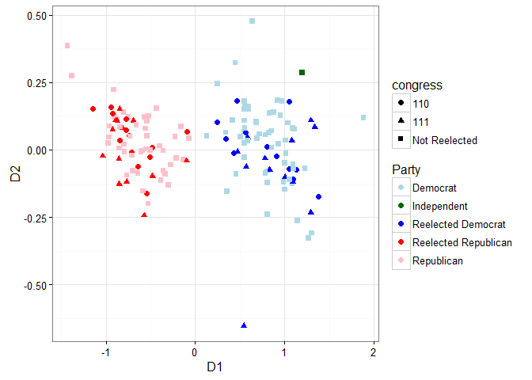

This package provides tools to query and download from the VoteView database. This vignette will demonstrate the different types of queries that can be used, how `Rvoteview` can be used to do ideal point estimation on a subset of votes using the `pscl` package and the `wnominate` package, and how `Rvoteview` facilitates regression analyses of congressional voting behavior.

1.  [Installation](#installation)
2.  [Querying the database with `voteview_search`](#querying-the-database-with-voteview_search)
3.  [Downloading roll call data with `voteview_download`](#downloading-roll-call-data%20with-voteview_download)
4.  [Additional Methods](#additional-methods)
    1.  [Joining two `rollcall` objects](#joining-two-rollcall-objects)
    2.  [Melting `rollcall` objects](#melting-rollcall-objects)
    3.  [Completing interrupted downloads](#completing-interrupted-downloads)
    4.  [Retrieving member data](#retrieving-member-data)

5.  [Extended Examples](#extended-examples)
    1.  [Ideal point estimation](#ideal-point-estimation)
    2.  [Analyzing ideal points across reelection](#analyzing-ideal-points-across-reelection)
    3.  [Regression analysis of roll call behavior](#regression-analysis-of-roll-call-behavior)

Installation
============

To install this package, ensure you have `devtools` installed. If you do not, run `install.packages("devtools")` and then install from GitHub using

``` r
devtools::install_github("JeffreyBLewis/Rvoteview")
```

For a quick start, see the README in the GitHub repository [here](https://github.com/JeffreyBLewis/Rvoteview).

Querying the database with `voteview_search`
============================================

The first main function of this package is to allow users to search for roll calls. Using a custom query parser, we allow both simple and complex queries to be made to the VoteView database. The simple way uses a set of arguments to build a query within the `R` package while the complex way allows the user to build a specific query with nested, boolean logic. Both can also be used simultaneously. You can find the full documentation for the query parser [here](https://github.com/JeffreyBLewis/Rvoteview/wiki/Query-Documentation).

Simple text queries
-------------------

The `q` argument should be treated similarly to a search box online. You can put in text search terms, specific fields with parameters, or it can be left blank if other arguments are used. The simple usage is to treat the `q` argument as a way to search all text fields. If you want to search a specific phrase, put the query in quotes. This will essentially look for that exact phrase in any of the text fields in the database. Alternatively, if you search without using quotes, the word will be lemmatized (shortened) and will search an index of the text fields. For example, we can search for "terrorism" exactly or loosely using the index:

``` r
library(Rvoteview)
res <- voteview_search("'terrorism'")
## 37 found rollcalls
res <- voteview_search("terrorism")
## 238 found rollcalls
```

You can also search for multiple words:

``` r
res <- voteview_search("terrorism iraq")
## 619 found rollcalls
```

Using the text index, the MongoDB that houses the rollcalls will search for the documents for either of these words and return the best matches. In effect, this will return documents that have *either* "terror" or "iraq" or various shortened versions of those words.

Basic syntax
------------

When using one of the simple queries above, the query parser automatically adds a field to the front of a query that does not specify which field to search. In order to specify a specific field, use the following `fieldname:query` syntax. To replicate the last example more explicitly, we use the following:

``` r
res <- voteview_search("alltext:terrorism iraq")
## 619 found rollcalls
```

Unfortunately, due to the way the text index works, to search for documents that have both "terror" *and* "iraq" will require some more work. One way to do this is to search a specific text field more than once, as queries across fields will be joined by AND by default:

``` r
res <- voteview_search("description:'terror' description:'iraq'")
## 1 found rollcalls
```

Unfortunately, the full text index cannot be accessed more than once at a time. That means that you cannot have two text fields that you search without quotes. Thus, `"description:iraq description:terror"` will not work and neither will `"alltext:iraq alltext:terror"`.

Using additional arguments
--------------------------

Users can also use other arguments to search only roll calls that are in a certain chamber of Congress, within a date range, within a certain set of congresses, and within a level of support, defined as the percent of total valid votes that were yea vote. This is especially useful if users only want to return competitive votes. Note that all fields are joined using "AND" logic; for example you search for roll calls using the keyword "tax" AND are in the House but not votes that either use the keyword "tax" OR were held in the House. Also note that the congress field uses "OR" logic within the numeric vector that specifices which congress to search. No roll call can be in two congresses, so it makes no sense to search for roll calls that are in one congress AND in another congress.

``` r
## Search for votes with a start date
## Note that because tax is not in quotes, it searches the text index and not for
## exact matches
res <- voteview_search("tax", startdate = "2005-01-01")
```

    #> Query '(tax) AND (startdate:2005-01-01)' returned 636 rollcalls...

``` r
## Search for votes with an end date in just the House
res <- voteview_search("tax", enddate = "2005-01-01", chamber = "House")
```

    #> Query '(tax) AND (enddate:2005-01-01) AND (chamber:house)' returned 1518 rollcalls...

``` r
## Search for votes with a start date in just the house in the 110th or 112th Congress
res <- voteview_search("tax",
                       startdate = "2000-12-20",
                       congress = c(110, 112),
                       chamber = "House")
```

    #> Query '(tax) AND (startdate:2000-12-20) AND (congress:110 112) AND (chamber:house)' returned 113 rollcalls...

You can always see exactly what search was used to create a set of roll calls by retrieving the 'qstring' attribute of the returned data frame:

``` r
attr(res, "qstring")
```

    #> [1] "(tax) AND (startdate:2000-12-20) AND (congress:110 112) AND (chamber:house)"

Building complex queries
------------------------

As previewed before, users can use the `q` argument to specify complex queries by specifying which fields to search and how to combine fields using boolean logic. The [complete documentation can be found here](https://github.com/JeffreyBLewis/Rvoteview/wiki/Query-Documentation). In general, the following syntax is used, `field:specific phrase (field:other phrase OR field:second phrase)`.

For example, if you wanted to find votes with "war" and either "iraq" or "afghanistan" in the description field, you could set the query to:

``` r
qString <- "description:'war' (description:'iraq' OR description:'afghanistan')"
res <- voteview_search(q = qString)
```

    #> Query 'description:"war" (description:"iraq" OR description:"afghanistan")' returned 9 rollcalls...

Numeric fields can be searched in a similar way, although users can also use square brackets and "to" for ranges of numbers. For example, the query for all votes about taxes in the 100th to 102nd congress could be expressed either using `"alltext:taxes congress:100 OR congress:101 OR congress:102"` or using `"alltext:taxes congress:[100 to 102]"`. Note that if you want to restrict search to certain dates, the `startdate` and `enddate` arguments in the function should be used.

For example,

``` r
## Search for "war" AND ("iraq" or "afghanistan") in the description field in 1991
res <- voteview_search(q = qString,
                       startdate = "1991-01-01",
                       enddate = "1991-12-31")
```

The fields that can be searched with text are `codes`, `codes.Clausen`, `codes.Peltzman`, `codes.Issue`, `description`, `shortdescription`, `bill`, and `alltext`. The fields that can be searched by number are `congress`, `yea`, `nay`, and `support`. Searching by individual legislator will be implemented soon.

Downloading roll call data with `voteview_download`
===================================================

The second main function of this package is to allow users to download detailed roll call data into a modified `rollcall` object from the `pscl` package. The default usage is to pass `voteview_download` a vector of roll call id numbers that we return in the `voteview_search` function.

``` r
## Search all votes with the exact phrase "estate tax"
res <- voteview_search("'estate tax'")

## Download all estate tax votes
rc <- voteview_download(res$id)

summary(rc)
```

    #> Source:       Download from VoteView 
    #> 
    #> Number of Legislators:        1043
    #> Number of Roll Call Votes:    23
    #> 
    #> 
    #> Using the following codes to represent roll call votes:
    #> Yea:      1 2 3 
    #> Nay:      4 5 6 
    #> Abstentions:  7 8 9 
    #> Not In Legislature:   0 
    #> 
    #> Party Composition:
    #>  100  112  200  537 <NA> 
    #>  596    1  445    1    0 
    #> 
    #> Vote Summary:
    #>                Count Percent
    #> 0 (notInLegis) 21375    89.1
    #> 1 (yea)         1429     6.0
    #> 2 (yea)           27     0.1
    #> 3 (yea)           33     0.1
    #> 4 (nay)           17     0.1
    #> 5 (nay)           29     0.1
    #> 6 (nay)          825     3.4
    #> 7 (missing)       29     0.1
    #> 9 (missing)      225     0.9
    #> 
    #> Use summary(rc,verbose=TRUE) for more detailed information.

Importantly, the object we return is a modified `rollcall` object, in that it may contain additional elements that the authors of the `pscl` package did not include. Therefore it will work with all of the methods they wrote for `rollcall` objects as well as some methods we include in this package. The biggest difference between the original `rollcall` object and what we return is the inclusion of "long" versions of the `votes.data` and `legis.data` data frames, described below.

First, because icpsr numbers are not necessarily unique to legislators, we include `legis.long.dynamic` in the output. For example, when Strom Thurmond changed parties, his icpsr number also changed. However, when building rollcall objects, icpsr numbers are the default. Therefore, `legis.long.dynamic` contains a record of every legislator-party-congress as a unique id, as well as the relevant covariates.

Second, we include `votes.long`, a data frame where the rows are legislator-roll calls and contain how each legislator voted on each roll call. This is the long version of the `votes` matrix included in all `rollcall` objects.

Additional Methods
==================

We also add three methods that can be used on `rollcall` objects created by our package.

Joining two `rollcall` objects
------------------------------

The first function allows for a full outer join of two `rollcall` objects downloaded from the VoteView database, creating a new `rollcall` object that is a union of the two. It is called by using the `%+%` operator. This is especially useful if the user downloaded two roll call objects at separate times and wants to join them together rather than re-download all of the votes at the same time.

``` r
## Search all votes with exact phrase "estate tax"
res <- voteview_search("'estate tax'")

## Download first 10 votes
rc1 <- voteview_download(res$id[1:10])
## Download another 10 votes with some overlap
rc2 <- voteview_download(res$id[5:14])

## Merge them together
rcall <- rc1 %+% rc2

rcall$m # The number of total votes
```

    #> [1] 14

Melting `rollcall` objects
--------------------------

We also provide a function called `melt_rollcall` which allows users to produce a long data frame that is essentially the same as `votes.long` but includes all of the roll call and legislator data on each row.

``` r
## Default is to retain all data
rc_long <- melt_rollcall(rcall)
rc_long[1:3, ]
```

    #>           id     vname vote rollnumber chamber       date congress
    #> 1 MH07303558 RS0730160    1        160  Senate 1934-04-12       73
    #> 2 MS07303216 RS0730160    9        160  Senate 1934-04-12       73
    #> 3 MS07303347 RS0730160    1        160  Senate 1934-04-12       73
    #>                                              description question yea nay
    #> 1 TO AMEND H.R. 7835, BY INCREASING RATES ON ESTATE TAX.     <NA>  68  17
    #> 2 TO AMEND H.R. 7835, BY INCREASING RATES ON ESTATE TAX.     <NA>  68  17
    #> 3 TO AMEND H.R. 7835, BY INCREASING RATES ON ESTATE TAX.     <NA>  68  17
    #>   vote_result codes.Issue          codes.Peltzman         codes.Clausen
    #> 1        <NA>   Tax rates Budget General Interest Government Management
    #> 2        <NA>   Tax rates Budget General Interest Government Management
    #> 3        <NA>   Tax rates Budget General Interest Government Management
    #>   nomslope nomintercept icpsr                    name party_code
    #> 1    1.588       -0.502  3558  GIBSON, Ernest Willard        200
    #> 2    1.588       -0.502  3216 FLETCHER, Duncan Upshaw        100
    #> 3    1.588       -0.502  3347    FRAZIER, Lynn Joseph        200
    #>   state_abbrev cqlabel district_code
    #> 1           VT (VT-01)             1
    #> 2           FL    (FL)             0
    #> 3           ND    (ND)             0

``` r
## Retaining fewer columns
rc_long <- melt_rollcall(rcall, votecols = c("chamber", "congress"))
rc_long[1:3, ]
```

    #>           id     vname vote chamber congress icpsr                    name
    #> 1 MH07303558 RS0730160    1  Senate       73  3558  GIBSON, Ernest Willard
    #> 2 MS07303216 RS0730160    9  Senate       73  3216 FLETCHER, Duncan Upshaw
    #> 3 MS07303347 RS0730160    1  Senate       73  3347    FRAZIER, Lynn Joseph
    #>   party_code state_abbrev cqlabel district_code
    #> 1        200           VT (VT-01)             1
    #> 2        100           FL    (FL)             0
    #> 3        200           ND    (ND)             0

Completing interrupted downloads
--------------------------------

If your internet connection drops in the middle of a download or you have to interrupt a download for some reason, the `voteview_download` function should try to complete building the `rollcall` object with whatever data it has successfully downloaded. While manually interrupting functions in `R` is tricky and we cannot catch interrupts perfectly, if it does succeed or if your connection does drop, then we store the roll call ids that you were unable to retrieve in the `unretrievedids` slot of our modified `rollcall` object. Users can then use the `complete_download` function to download the unretrieved ids and create a complete `rollcall` object. For example, imagine the following download stalls as your wireless cuts out at this cute coffee shop that has beans roasted in house but cannot manage a good wireless conenction:

``` r
rc_fail <- voteview_download(res$id)
```

If this fails but still manages to build a `rollcall` object with whatever ids it was able to retrieve, then we can complete the download with a simple command:

``` r
rc <- complete_download(rc_fail)
```

Again, because of the difficulty with properly catching interrupts in `R`, this will not always work with manual interrupts, but should work with dropped internet connections.

Retrieving member data
----------------------

There is also the ability to search the database for members (House Representatives, Senators, and Presidents) using the `member_search` function. Unfortunately, the syntax is not identical to the syntax when searching for roll calls. Nonetheless, the usage in `R` is quite simple. There are fields to search members' names, icpsr number, state (either ICPSR state number, two letter postal code, or the full name), the range of congresses to search within, the CQ label of the member, and the chamber to search within.

The function returns a data frame of metadata, with one row for each legislator-congress that is found (these are the unique entries in the database of members). Therefore, if we want to return all unique legislator-congresses where the name 'clinton' appears anywhere in the name fields, we can use the following search:

``` r
clintons <- member_search("clinton")

## Drop the bio field because it is quite long
clintons[1:7, names(clintons) != "bio"]
```

    #>           id icpsr                           bioname party_code cqlabel
    #> 1 MS11140105 40105           CLINTON, Hillary Rodham        100    (NY)
    #> 2 MS11040105 40105           CLINTON, Hillary Rodham        100    (NY)
    #> 3 MS10940105 40105           CLINTON, Hillary Rodham        100    (NY)
    #> 4 MS10840105 40105           CLINTON, Hillary Rodham        100    (NY)
    #> 5 MS10740105 40105           CLINTON, Hillary Rodham        100    (NY)
    #> 6 MP10699909 99909 CLINTON, William Jefferson (Bill)        100 (POTUS)
    #> 7 MP10599909 99909 CLINTON, William Jefferson (Bill)        100 (POTUS)
    #>   congress     state state_abbrev   chamber  bioImgURL congresses
    #> 1      111  New York           NY    Senate 040105.jpg   107, 111
    #> 2      110  New York           NY    Senate 040105.jpg   107, 111
    #> 3      109  New York           NY    Senate 040105.jpg   107, 111
    #> 4      108  New York           NY    Senate 040105.jpg   107, 111
    #> 5      107  New York           NY    Senate 040105.jpg   107, 111
    #> 6      106 President          USA President 099909.jpg   103, 106
    #> 7      105 President          USA President 099909.jpg   103, 106
    #>   district_code nominate.dim2 nominate.dim1 nominate.geo_mean_probability
    #> 1             0        -0.244        -0.365                         0.833
    #> 2             0        -0.244        -0.365                         0.917
    #> 3             0        -0.244        -0.365                         0.858
    #> 4             0        -0.244        -0.365                         0.880
    #> 5             0        -0.244        -0.365                         0.833
    #> 6             0         0.039        -0.439                         0.743
    #> 7             0         0.039        -0.439                         0.774

It is important to note that if there is no white space in the name field, the database is searched for exact matches for that one word. If there are multiple words we use a text index of all of the name fields and return the best matches.

If you only want to return the first record per ICPSR number, you can set the distinct flag equal to one. This is useful because it limits the size of the object returned and most data is duplicated within ICPSR number. For example, CS DW-NOMINATE scores are constant within ICPSR number, as are names and (usually) party.

``` r
clintons <- member_search("clinton",
                          state = "NY",
                          distinct = 1)

## Drop the bio field because it is quite long
clintons[, names(clintons) != "bio"]
```

    #>           id icpsr                     bioname party_code cqlabel congress
    #> 1 MS11140105 40105     CLINTON, Hillary Rodham        100    (NY)      111
    #> 2 MH04405875  5875  MacDOUGALL, Clinton Dugald        200 (NY-26)       44
    #> 3 MH04306426  6426       MERRIAM, Clinton Levi        200 (NY-21)       43
    #> 4 MH03805707  5707 LITTLEJOHN, De Witt Clinton        200 (NY-22)       38
    #> 5 MH02801850  1850       CLINTON, James Graham        100 (NY-09)       28
    #> 6 MH02306044  6044   MARTINDALE, Henry Clinton         26 (NY-12)       23
    #> 7 MH01001849  1849             CLINTON, George         13 (NY-02)       10
    #> 8 MS00801847  1847            CLINTON, De Witt         13    (NY)        8
    #>      state state_abbrev chamber      bioImgURL     congresses
    #> 1 New York           NY  Senate     040105.jpg       107, 111
    #> 2 New York           NY   House silhouette.png         43, 44
    #> 3 New York           NY   House     006426.jpg         42, 43
    #> 4 New York           NY   House     005707.jpg         38, 38
    #> 5 New York           NY   House silhouette.png         27, 28
    #> 6 New York           NY   House silhouette.png 18, 23, 21, 23
    #> 7 New York           NY   House silhouette.png          8, 10
    #> 8 New York           NY  Senate     001847.jpg           7, 8
    #>   district_code nominate.dim2 nominate.dim1 nominate.geo_mean_probability
    #> 1             0        -0.244        -0.365                         0.833
    #> 2            26        -0.460         0.451                         0.804
    #> 3            21        -0.771         0.352                         0.659
    #> 4            22         0.496         0.457                         0.730
    #> 5             9        -0.697        -0.261                         0.617
    #> 6            12        -0.102         0.681                         0.791
    #> 7             2         0.236         0.163                         0.712
    #> 8             0        -0.529        -0.366                         0.905

Some other fields that are not unique to ICPSR number but may vary are the chamber of the representative, their CQ label, and the number of votes they cast. Let's get all the records for Bernie Sanders.

``` r
sanders <- member_search("sanders",
                         state = "VT")

## Drop the bio field because it is quite long
sanders[, names(sanders) != "bio"]
```

    #>            id icpsr          bioname party_code cqlabel congress   state
    #> 1  MS11429147 29147 SANDERS, Bernard        328    (VT)      114 Vermont
    #> 2  MS11329147 29147 SANDERS, Bernard        328    (VT)      113 Vermont
    #> 3  MS11229147 29147 SANDERS, Bernard        328    (VT)      112 Vermont
    #> 4  MS11129147 29147 SANDERS, Bernard        328    (VT)      111 Vermont
    #> 5  MS11029147 29147 SANDERS, Bernard        328    (VT)      110 Vermont
    #> 6  MH10929147 29147 SANDERS, Bernard        328 (VT-01)      109 Vermont
    #> 7  MH10829147 29147 SANDERS, Bernard        328 (VT-01)      108 Vermont
    #> 8  MH10729147 29147 SANDERS, Bernard        328 (VT-01)      107 Vermont
    #> 9  MH10629147 29147 SANDERS, Bernard        328 (VT-01)      106 Vermont
    #> 10 MH10529147 29147 SANDERS, Bernard        328 (VT-01)      105 Vermont
    #> 11 MH10429147 29147 SANDERS, Bernard        328 (VT-01)      104 Vermont
    #> 12 MH10329147 29147 SANDERS, Bernard        328 (VT-01)      103 Vermont
    #> 13 MH10229147 29147 SANDERS, Bernard        328 (VT-01)      102 Vermont
    #>    state_abbrev chamber  bioImgURL congresses district_code nominate.dim2
    #> 1            VT  Senate 029147.jpg   102, 114             0        -0.271
    #> 2            VT  Senate 029147.jpg   102, 114             0        -0.271
    #> 3            VT  Senate 029147.jpg   102, 114             0        -0.271
    #> 4            VT  Senate 029147.jpg   102, 114             0        -0.271
    #> 5            VT  Senate 029147.jpg   102, 114             0        -0.271
    #> 6            VT   House 029147.jpg   102, 114             1        -0.271
    #> 7            VT   House 029147.jpg   102, 114             1        -0.271
    #> 8            VT   House 029147.jpg   102, 114             1        -0.271
    #> 9            VT   House 029147.jpg   102, 114             1        -0.271
    #> 10           VT   House 029147.jpg   102, 114             1        -0.271
    #> 11           VT   House 029147.jpg   102, 114             1        -0.271
    #> 12           VT   House 029147.jpg   102, 114             1        -0.271
    #> 13           VT   House 029147.jpg   102, 114             1        -0.271
    #>    nominate.dim1 nominate.geo_mean_probability
    #> 1         -0.508                         0.813
    #> 2         -0.508                         0.840
    #> 3         -0.508                         0.783
    #> 4         -0.508                         0.892
    #> 5         -0.508                         0.884
    #> 6         -0.508                         0.849
    #> 7         -0.508                         0.810
    #> 8         -0.508                         0.811
    #> 9         -0.508                         0.802
    #> 10        -0.508                         0.791
    #> 11        -0.508                         0.818
    #> 12        -0.508                         0.808
    #> 13        -0.508                         0.759

As you can see Sanders changes chambers between the 109th and 110th congresses and a few other fields differ as well. Nonetheless, most is repeated.

Extended Examples
=================

This section details three different possible uses of the `Rvoteview` package, showing users from beginning to end how to conduct their own ideal point estimation and use `Rvoteview` in more traditional regression analysis.

Ideal point estimation
----------------------

Imagine that we want to estimate ideal points for all legislators voting on foreign policy during Obama's first term in office. We will use all roll calls that fit the Clausen category "Foreign and Defense Policy" and are somewhat competitive, meaning between 15 and 85 percent of votes on the floor were yeas.

``` r
## Load packages
library(ggplot2)   # Load this first so that Rvoteview can use %+%
```

    #> 
    #> Attaching package: 'ggplot2'

    #> The following object is masked from 'package:Rvoteview':
    #> 
    #>     %+%

``` r
library(Rvoteview)

## Search database for votes that meet our criteria
res <- voteview_search("codes.Clausen:Foreign and Defense Policy support:[15 to 85]",
                       startdate = "2008-01-20", enddate = "2013-01-20")
```

    #> Query '(codes.Clausen:Foreign and Defense Policy support:[15 to 85]) AND (startdate:2008-01-20) AND (enddate:2013-01-20)' returned 555 rollcalls...

Large downloads can be quite slow for now, so be patient. We are working on improving speed. You can always download the full database yourself.

``` r
## Download votes into rollcall object
rc <- voteview_download(res$id)
```

``` r
summary(rc)
```

    #> Source:       Download from VoteView 
    #> 
    #> Number of Legislators:        734
    #> Number of Roll Call Votes:    555
    #> 
    #> 
    #> Using the following codes to represent roll call votes:
    #> Yea:      1 2 3 
    #> Nay:      4 5 6 
    #> Abstentions:  7 8 9 
    #> Not In Legislature:   0 
    #> 
    #> Party Composition:
    #>  100  200  328 <NA> 
    #>  359  374    1    0 
    #> 
    #> Vote Summary:
    #>                 Count Percent
    #> 0 (notInLegis) 212005    52.0
    #> 1 (yea)         92810    22.8
    #> 6 (nay)         95350    23.4
    #> 7 (missing)       246     0.1
    #> 9 (missing)      6959     1.7
    #> 
    #> Use summary(rc,verbose=TRUE) for more detailed information.

Now we use the `wnominate` package to run an ideal point estimation. Warning, this is somewhat slow and is thus not run in the vignette.

``` r
library(wnominate)
# Find extreme legislators for polarity argument
cons1 <- rc$legis.long.dynamic[which.max(rc$legis.data$dim1), c("name", "icpsr")]
cons2 <- rc$legis.long.dynamic[which.max(rc$legis.data$dim2), c("name", "icpsr")]
defIdeal <- wnominate(rc,
                      polarity = list("icpsr", c(20753, 20523)))
```

The `rollcall` objects we build can also be used in the `ideal` function in the `pscl` package.

``` r
library(pscl)
defIdeal <- ideal(rc,
                  d = 2)
```

In this case we get a vector of ideal points along two dimensions. We can use the default `plot` method provided by `pscl` to get a quick look at the estimated points:

``` r
plot(defIdeal)
```


This ideal point estimation also returns estimated points in a matrix that has has the same row names as the `rc$legis.data` data frame, which are ICPSR numbers. They are also in the same order so it is easy to bring the ideal points to the rest of the data. Let's do that and create a custom plot.

``` r
## Add custom ideal points to legislator data
idealdf <- cbind(rc$legis.data, defIdeal$xbar)
## Create text party name
idealdf$partyName <- ifelse(idealdf$party == 200, "Republican",
                     ifelse(idealdf$party == 100, "Democrat", "Independent"))
rc$legis.data
ggplot(idealdf, aes(x=D1, y=D2, color=partyName, label=state_abbrev)) +
  geom_text() +
  scale_color_manual("Party", values = c("Republican" = "red",
                                         "Democrat" = "blue",
                                         "Independent" = "darkgreen")) + 
  theme_bw()
```


We see the usual split between Republicans and Democrats.

Analyzing ideal points across reelection
----------------------------------------

One use of the package may be to estimate ideal points across congresses, holding fixed those who did not face reelection while allowing those reelected to move. First, let's get all of the roll calls from the 110th and 111th congresses.

``` r
## Find roll calls from 110 and 111th congresses
senateRes <- voteview_search(chamber = "Senate",
                             congress = c(110, 111))
```

    #> Query '() AND (congress:110 111) AND (chamber:senate)' returned 1353 rollcalls...

In order to allow senators who were reelected to move across congresses, we have to construct a roll call object that treats those that were reelected as different legislators. We can use the internal functions of the package to help us with this.

First, let's download two rollcall objects for each congress and add data on which Senators were reelected.

``` r
## Download the rollcalls to separate objects
senate110 <- voteview_download(senateRes$id[senateRes$congress == 110])
```

    #> Downloading 657 rollcalls

    #> Reading vote data for 657 rollcalls

    #> Building vote matrix

    #> Building legis.data matrix

    #> Building rollcall object, may take some time...

``` r
senate111 <- voteview_download(senateRes$id[senateRes$congress == 111])
```

    #> Downloading 696 rollcalls

    #> Reading vote data for 696 rollcalls

    #> Building vote matrix

    #> Building legis.data matrix

    #> Building rollcall object, may take some time...

``` r
## Add the congress to the legislator data frame
senate110$legis.long.dynamic$congress <- 110
senate111$legis.long.dynamic$congress <- 111

## The icpsr numbers of the reelected senators
reelected <- c("49700", "40301", "14101", "29512", "15021", "14230", "14852",
               "14921", "49702", "49703", "14920", "14709", "14009", "29534",
               "14203", "14914", "15424", "29142", "29566", "15425", "40304",
               "40305", "14922", "40707", "49706")
```

Now, because we build rollcall objects using primarily a vote matrix, we want to create that matrix with a unique row for each congress for each Senator that was reelected. Therefore, reelected senators have two rows in the vote matrix while those that were not reelected only have one row. To do this, we first make it so that the rownames of the vote matrices in the 110 and 111th congresses are augmented by the congress number for reelected senators.

``` r
## Giving them unique icpsr numbers with congress attached to them
rownames(senate111$votes) <- ifelse(rownames(senate111$votes) %in% reelected,
                                    paste0(rownames(senate111$votes), "_111"),
                                    rownames(senate111$votes))
rownames(senate110$votes) <- ifelse(rownames(senate110$votes) %in% reelected,
                                    paste0(rownames(senate110$votes), "_110"),
                                    rownames(senate110$votes))
```

Then we merge these vote matrices together, producing a matrix with reelected senators twice and other senators once:

``` r
## Merging their votes together
votedf <- merge(senate110$votes,
                senate111$votes,
                by = "row.names",
                all = T)

## The first column is the names and becomes the rownames for the vote matrix
votemat <- as.matrix(votedf[, 2:ncol(votedf)])
rownames(votemat) <- votedf[, 1]

## next we add the same name augmentation to the legislator metadata
senate110$legis.data$icpsr <- ifelse(senate110$legis.data$icpsr %in% reelected,
                                    paste0(senate110$legis.data$icpsr, "_110"),
                                    senate110$legis.data$icpsr)
senate111$legis.data$icpsr <- ifelse(senate111$legis.data$icpsr %in% reelected,
                                    paste0(senate111$legis.data$icpsr, "_111"),
                                    senate111$legis.data$icpsr)

## Merge in the legislators who weren't in the 110th or were reelected
legis.data <- rbind(senate110$legis.data,
                    senate111$legis.data[!(senate111$legis.data$icpsr %in% senate110$legis.data$icpsr), ])
## Reorder using votematrix
legis.data <- legis.data[match(rownames(votemat), legis.data$icps), ]

## And finally we buid the new rollcall object
rc <- pscl::rollcall(data = votemat,
               yea = c(1, 2, 3),
               nay = c(4, 5, 6),
               missing = c(7, 8, 9),
               notInLegis = c(0, NA),
               legis.data = legis.data,
               legis.names = rownames(votemat),
               vote.names = colnames(votemat))
```

To see what we have built, let's see the vote matrix for three kinds of legislators:

-   Dick Durbin, a Senator reelected in 2008 (ICPSR: 14009)
-   Jon Kyl, who was in both congresses but not reelected in 2008 (ICPSR: 15429)
-   Al Franken, who was newly elected in 2008 (ICPSR: 40904)

``` r
## 5 votes from 110th
rc$votes[grepl("14009|15429|40904", rownames(rc$votes)), 1:5]
```

    #>           RS1100001 RS1100002 RS1100003 RS1100004 RS1100005
    #> 14009_110         1         1         6         6         6
    #> 14009_111        NA        NA        NA        NA        NA
    #> 15429             1         1         6         6         6
    #> 40904            NA        NA        NA        NA        NA

``` r
## 5 votes from 111th
rc$votes[grepl("14009|15429|40904", rownames(rc$votes)), (ncol(rc$votes)-4):ncol(rc$votes)]
```

    #>           RS1110692 RS1110693 RS1110694 RS1110695 RS1110696
    #> 14009_110        NA        NA        NA        NA        NA
    #> 14009_111         1         1         1         1         1
    #> 15429             1         1         1         6         1
    #> 40904             6         6         6         1         1

As you can see, Al Franken is missing votes from the 110th, as is the reelected version of Dick Durbin. In the 111th votes, the old version of Dick Durbin, "14009\_110", is missing votes. Now let's do some ideal point estimation:

``` r
id <- pscl::ideal(rc,
                  d = 2)
```

Let's plot the output.

``` r
## Add custom ideal points to legislator data
idealdf <- cbind(rc$legis.data, id$xbar)
idealdf$reelected <- grepl("_", idealdf$icpsr)
## Create text party name
idealdf$partyName <- ifelse(idealdf$party == 200 & !idealdf$reelected, "Republican",
                     ifelse(idealdf$party == 100 & !idealdf$reelected, "Democrat",
                     ifelse(idealdf$party == 328 & !idealdf$reelected, "Independent",
                     ifelse(idealdf$party == 200 & idealdf$reelected,
                            "Reelected Republican",
                            "Reelected Democrat"))))
idealdf$congress <- ifelse(!idealdf$reelected,
                           "Not Reelected",
                           substr(idealdf$icpsr, nchar(idealdf$icpsr) - 2, nchar(idealdf$icpsr)))

## Plot the ideal points
ggplot(idealdf, aes(x=D1, y=D2, color=partyName, label=icpsr, shape = congress)) +
  geom_point(size = 2) +
  scale_color_manual("Party", values = c("Republican" = "pink",
                                         "Democrat" = "lightblue",
                                         "Independent" = "darkgreen",
                                         "Reelected Republican" = "red",
                                         "Reelected Democrat" = "blue")) + 
  theme_bw()
```



Regression analysis of roll call behavior
-----------------------------------------

Users can also use the VoteView API to run regression analyses. Let's take the state level opinion data on gay rights that was estimated in [Lax and Phillips (2009)](http://dx.doi.org/10.1017/S0003055409990050). They used multilevel regression and poststratification on surveys from 1999-2008 in order to estimate state-level explicit support for gay rights issues. Let's pull down some important bills presented before the 111th congress (2009-2011) and see how state level public opinion in the preceding years predicts voting behavior in the legislature.

Let's see what bills there were in the 111th congress that had to do with homosexuality. We can use a search that will capture quite a few different bills.

``` r
## Two separate searches because fields cannot be joined with an OR
res <- voteview_search("codes.Issue:Homosexuality congress:111")
```

    #> Query 'codes.Issue:Homosexuality congress:111' returned 18 rollcalls...

``` r
res
```

    #>           id congress chamber rollnumber       date yea nay support
    #> 1  RH1110218      111   House        218 2009-04-29 234 181   56.39
    #> 2  RH1110219      111   House        219 2009-04-29 234 190   55.19
    #> 3  RH1110221      111   House        221 2009-04-29 185 241   43.43
    #> 4  RH1110222      111   House        222 2009-04-29 249 175   58.73
    #> 5  RS1110231      111  Senate        231 2009-07-16  29  62   31.87
    #> 6  RS1110232      111  Senate        232 2009-07-16  78  13   85.71
    #> 7  RS1110327      111  Senate        327 2009-10-22  68  29   70.10
    #> 8  RS1110486      111  Senate        486 2010-03-25  36  59   37.89
    #> 9  RS1110635      111  Senate        635 2010-09-21  56  43   56.57
    #> 10 RS1110667      111  Senate        667 2010-12-09  57  40   58.76
    #> 11 RS1110676      111  Senate        676 2010-12-18  63  33   65.63
    #> 12 RS1110678      111  Senate        678 2010-12-18  66  31   68.04
    #> 13 RH1110752      111   House        752 2009-10-06 178 234   43.20
    #> 14 RH1110767      111   House        767 2009-10-08 208 216   49.06
    #> 15 RH1110768      111   House        768 2009-10-08 281 146   65.81
    #> 16 RH1111302      111   House       1302 2010-05-27 231 194   54.35
    #> 17 RH1111618      111   House       1618 2010-12-15 232 180   56.31
    #> 18 RH1111621      111   House       1621 2010-12-15 251 175   58.92
    #>                                  vote_result
    #> 1                                     Passed
    #> 2                                     Passed
    #> 3                                     Failed
    #> 4                                     Passed
    #> 5                         Amendment Rejected
    #> 6                        Amendment Agreed to
    #> 7                Conference Report Agreed to
    #> 8                            Motion Rejected
    #> 9                    Cloture Motion Rejected
    #> 10 Cloture on the Motion to Proceed Rejected
    #> 11                  Cloture Motion Agreed to
    #> 12                          Motion Agreed to
    #> 13                                    Failed
    #> 14                                    Failed
    #> 15                                    Passed
    #> 16                                 Agreed to
    #> 17                                    Passed
    #> 18                                    Passed
    #>                                         short_description
    #> 1                                      HATE CRIMES (PROC)
    #> 2                                     HATE CRIMES -- RULE
    #> 3                                 HATE CRIMES -- RECOMMIT
    #> 4                                      HATE CRIMES (PASS)
    #> 5                                             HATE CRIMES
    #> 6                                             HATE CRIMES
    #> 7                     DEFENSE AUTH AND HATE CRIMES (PASS)
    #> 8  HEALTH CARE OVERHAUL RECONCILIATION -- DC GAY MARRIAGE
    #> 9            DEFENSE AUTH & DONT ASK DONT TELL -- CLOTURE
    #> 10         DEFENSE AUTH & DON'T ASK DON'T TELL -- CLOTURE
    #> 11                      END DONT ASK DONT TELL -- CLOTURE
    #> 12                          END DONT ASK DONT TELL (PASS)
    #> 13                                     HATE CRIMES (PROC)
    #> 14   DEFENSE AUTH WITH HATE CRIMES ATTACHMENT -- RECOMMIT
    #> 15               DEFENSE AUTH WITH HATE CRIMES ATTACHMENT
    #> 16        DEFENSE AUTH -- END DON'T ASK DON'T TELL POLICY
    #> 17                         END DONT ASK DONT TELL -- RULE
    #> 18                          END DONT ASK DONT TELL (PASS)
    #>                                                         question
    #> 1                              On Ordering the Previous Question
    #> 2                                  On Agreeing to the Resolution
    #> 3                        On Motion to Recommit with Instructions
    #> 4                                                     On Passage
    #> 5                                               On the Amendment
    #> 6                                               On the Amendment
    #> 7                                       On the Conference Report
    #> 8                                                  On the Motion
    #> 9                                          On the Cloture Motion
    #> 10                           On Cloture on the Motion to Proceed
    #> 11                                         On the Cloture Motion
    #> 12                                                 On the Motion
    #> 13                               On Motion to Instruct Conferees
    #> 14                       On Motion to Recommit with Instructions
    #> 15                          On Agreeing to the Conference Report
    #> 16                                  On Agreeing to the Amendment
    #> 17                                 On Agreeing to the Resolution
    #> 18 On Motion to Concur in the Senate Amendment with an Amendment
    #>                                                                                                                                                                                                                                                                                                                                                                                                                                                                           text
    #> 1                                                                                                                                                                                                                                                                                                                           Providing for consideration of H.R. 1913, to provide Federal assistance to States, local jurisdictions, and Indian tribes to prosecute hate crimes
    #> 2                                                                                                                                                                                                                                                                                                                           Providing for consideration of H.R. 1913, to provide Federal assistance to States, local jurisdictions, and Indian tribes to prosecute hate crimes
    #> 3                                                                                                                                                                                                                                                                                                                                                                                                                             Local Law Enforcement Hate Crimes Prevention Act
    #> 4                                                                                                                                                                                                                                                                                                                                                                                                                             Local Law Enforcement Hate Crimes Prevention Act
    #> 5                                                                                                                                                                                                                                                                                                                                                                                                                            To prevent duplication in the Federal government.
    #> 6                                                                                                                                                                                                                                                                                                                                                                       To clarify that the amendment shall not be construed or applied to infringe on First Amendment rights.
    #> 7  To authorize appropriations for fiscal year 2010 for military activities of the Department of Defense, for military construction, and for defense activities of the Department of Energy, to prescribe military personnel strengths for such fiscal year, to provide special pays and allowances to certain members of the Armed Forces, expand concurrent receipt of military retirement and VA disability benefits to disabled military retirees, and for other purposes.
    #> 8                                                                                                                                                                                                                                                                                                                                                                To protect the democratic process and the right of the people of the District of Columbia to define marriage.
    #> 9                                                                                                                                                                           An original bill to authorize appropriations for fiscal year 2011 for military activities of the Department of Defense, for military construction, and for defense activities of the Department of Energy, to prescribe military personnel strengths for such fiscal year, and for other purposes.
    #> 10                                                                                                                                                                          An original bill to authorize appropriations for fiscal year 2011 for military activities of the Department of Defense, for military construction, and for defense activities of the Department of Energy, to prescribe military personnel strengths for such fiscal year, and for other purposes.
    #> 11                                                                                                                                                                                                                                                                                           A bill to amend the Small Business Act with respect to the Small Business Innovation Research Program and the Small Business Technology Transfer Program, and for other purposes.
    #> 12                                                                                                                                                                                                                                                                                           A bill to amend the Small Business Act with respect to the Small Business Innovation Research Program and the Small Business Technology Transfer Program, and for other purposes.
    #> 13                                                                                                                                                                                                                                                                                                                                                                                                                                Department of Defense Authorization, FY 2010
    #> 14                                                                                                                                                                                                                                                                                                                                                                                                                                Department of Defense Authorization, FY 2010
    #> 15                                                                                                                                                                                                                                                                                                                                                                                                                                Department of Defense Authorization, FY 2010
    #> 16                                                                                                                                                                                                                                                                                                                                                                                                                             Patrick Murphy of Pennsylvania Amendment No. 79
    #> 17                                                                                                                                                                                                                                                                                                                                                                                                            Providing for consideration of the Senate amendment to H.R. 2965
    #> 18                                                                                                                                                                                                                                                                                                                                                                                                                                    Don<U+0092>t Ask, Don<U+0092>t Tell Repeal Act of 2010
    #>    key_flags
    #> 1       NULL
    #> 2       NULL
    #> 3       NULL
    #> 4       NULL
    #> 5       NULL
    #> 6       NULL
    #> 7       NULL
    #> 8       NULL
    #> 9       NULL
    #> 10      NULL
    #> 11        CQ
    #> 12        CQ
    #> 13      NULL
    #> 14      NULL
    #> 15      NULL
    #> 16      NULL
    #> 17      NULL
    #> 18      NULL
    #>                                                            codes.Issue
    #> 1  Civil Rights/Desegregation/Busing/Affirmative Action, Homosexuality
    #> 2  Civil Rights/Desegregation/Busing/Affirmative Action, Homosexuality
    #> 3  Civil Rights/Desegregation/Busing/Affirmative Action, Homosexuality
    #> 4  Civil Rights/Desegregation/Busing/Affirmative Action, Homosexuality
    #> 5  Civil Rights/Desegregation/Busing/Affirmative Action, Homosexuality
    #> 6  Civil Rights/Desegregation/Busing/Affirmative Action, Homosexuality
    #> 7  Civil Rights/Desegregation/Busing/Affirmative Action, Homosexuality
    #> 8                                         Public Health, Homosexuality
    #> 9                                                        Homosexuality
    #> 10                                                       Homosexuality
    #> 11                                                       Homosexuality
    #> 12                                                       Homosexuality
    #> 13 Civil Rights/Desegregation/Busing/Affirmative Action, Homosexuality
    #> 14 Civil Rights/Desegregation/Busing/Affirmative Action, Homosexuality
    #> 15 Civil Rights/Desegregation/Busing/Affirmative Action, Homosexuality
    #> 16                                                       Homosexuality
    #> 17                                                       Homosexuality
    #> 18                                                       Homosexuality
    #>                                        codes.Peltzman
    #> 1     Domestic Social Policy, Budget Special Interest
    #> 2     Domestic Social Policy, Budget Special Interest
    #> 3     Domestic Social Policy, Budget Special Interest
    #> 4     Domestic Social Policy, Budget Special Interest
    #> 5       Domestic Social Policy, Defense Policy Budget
    #> 6       Domestic Social Policy, Defense Policy Budget
    #> 7                               Defense Policy Budget
    #> 8     Domestic Social Policy, Budget General Interest
    #> 9       Defense Policy Budget, Domestic Social Policy
    #> 10      Defense Policy Budget, Domestic Social Policy
    #> 11 Defense Policy Resolutions, Domestic Social Policy
    #> 12 Defense Policy Resolutions, Domestic Social Policy
    #> 13      Domestic Social Policy, Defense Policy Budget
    #> 14      Defense Policy Budget, Domestic Social Policy
    #> 15      Defense Policy Budget, Domestic Social Policy
    #> 16      Defense Policy Budget, Domestic Social Policy
    #> 17 Defense Policy Resolutions, Domestic Social Policy
    #> 18 Defense Policy Resolutions, Domestic Social Policy
    #>                 codes.Clausen
    #> 1             Civil Liberties
    #> 2             Civil Liberties
    #> 3             Civil Liberties
    #> 4             Civil Liberties
    #> 5             Civil Liberties
    #> 6             Civil Liberties
    #> 7  Foreign and Defense Policy
    #> 8              Social Welfare
    #> 9  Foreign and Defense Policy
    #> 10 Foreign and Defense Policy
    #> 11 Foreign and Defense Policy
    #> 12 Foreign and Defense Policy
    #> 13            Civil Liberties
    #> 14 Foreign and Defense Policy
    #> 15 Foreign and Defense Policy
    #> 16 Foreign and Defense Policy
    #> 17 Foreign and Defense Policy
    #> 18 Foreign and Defense Policy

``` r
res2 <- voteview_search("gay lesbian congress:111")
```

    #> Query 'gay lesbian congress:111' returned 1 rollcalls...

``` r
res2
```

    #>          id congress chamber rollnumber       date yea nay support
    #> 1 RS1110486      111  Senate        486 2010-03-25  36  59   37.89
    #>       vote_result                                      short_description
    #> 1 Motion Rejected HEALTH CARE OVERHAUL RECONCILIATION -- DC GAY MARRIAGE
    #>        question
    #> 1 On the Motion
    #>                                                                                                            text
    #> 1 To protect the democratic process and the right of the people of the District of Columbia to define marriage.
    #>       score                  codes.Issue
    #> 1 0.5714286 Public Health, Homosexuality
    #>                                    codes.Peltzman  codes.Clausen
    #> 1 Domestic Social Policy, Budget General Interest Social Welfare

To focus on actual bills that were of some consequence, let's take the House and Senate don't ask don't tell votes and the hate crimes bill from the House.

``` r
dadt <- voteview_download(c("RH1111621", "RS1110678", "RH1110222"))
dadt$vote.data
```

Now we want to turn this into a long dataframe, where each row is a legislator-vote. We could also then cast this using a standard cast function or the `reshape2` package to have each row be a legislator, or each row be a legislator-congress and so on. The longer format will serve our purposes for now. Note that `dim1` and `dim2` are the Common Space DW-Nominate positions on the first and second ideological dimensions. They are fixed over the legislator's tenure in office.

``` r
## Only retain certain columns with respect to the legislator and the vote
dadtLong <- melt_rollcall(dadt,
                          legiscols = c("name", "state_abbrev","party_code", "dim1", "dim2"),
                          votecols = c("vname", "date", "chamber"))
head(dadtLong)
```

    #>           id     vname vote chamber       date                     name
    #> 1 MH11102605 RH1111621    1   House 2010-12-15 DINGELL, John David, Jr.
    #> 2 MH11115627 RH1111621    6   House 2010-12-15  STEARNS, Clifford Bundy
    #> 3 MH11129149 RH1111621    1   House 2010-12-15          MORAN, James P.
    #> 4 MH11110713 RH1111621    1   House 2010-12-15       CONYERS, John, Jr.
    #> 5 MH11112036 RH1111621    1   House 2010-12-15         OBEY, David Ross
    #> 6 MH11115634 RH1111621    1   House 2010-12-15     ROS-LEHTINEN, Ileana
    #>   party_code state_abbrev   dim2   dim1
    #> 1        100           MI  0.318 -0.449
    #> 2        200           FL -0.065  0.553
    #> 3        100           VA -0.191 -0.303
    #> 4        100           MI -0.457 -0.661
    #> 5        100           WI -0.056 -0.451
    #> 6        200           FL -0.194  0.245

Included in the package is a dataframe that links the numeric ICPSR codes to state names and state mail codes. You can load the data by calling `data(states)`. We use this to merge in the proper state names that will be matched to the Lax and Phillips (2009) dataset. Obama appears three times in this dataset and will be dropped in this merge.

``` r
data(states)
dadtLong <- merge(dadtLong, states[, c("state_abbrev", "state_name")],
                  by = "state_abbrev")

dadtLong$state_name <- tolower(dadtLong$state_name)
```

Now we use the Lax and Phillips (2009) data, which we make available in the package as well under `lpOpinion`.

``` r
data(lpOpinion)
lpOpinion$state <- tolower(lpOpinion$state)

df <- merge(dadtLong, lpOpinion,
            by.x = "state_name", by.y = "state")
head(df)
```

    #>   state_name state_abbrev         id     vname vote chamber       date
    #> 1    alabama           AL MH11120901 RH1110222    6   House 2009-04-29
    #> 2    alabama           AL MH11120301 RH1110222    6   House 2009-04-29
    #> 3    alabama           AL MH11120300 RH1111621    6   House 2010-12-15
    #> 4    alabama           AL MH11120301 RH1111621    6   House 2010-12-15
    #> 5    alabama           AL MH11120900 RH1110222    6   House 2009-04-29
    #> 6    alabama           AL MH11120302 RH1110222    6   House 2009-04-29
    #>                              name party_code  dim2   dim1
    #> 1                GRIFFITH, Parker        100 0.539 -0.045
    #> 2             ROGERS, Mike Dennis        200 0.508  0.331
    #> 3 BONNER, Jr., Josiah Robins (Jo)        200 0.516  0.366
    #> 4             ROGERS, Mike Dennis        200 0.508  0.331
    #> 5         BRIGHT, Bobby Neal, Sr.        100 0.690  0.066
    #> 6                    DAVIS, Artur        100 0.458 -0.269
    #>   secondParentAdoption hateCrimes healthBenefits housing jobs marriage
    #> 1                   29         61             54      68   53       23
    #> 2                   29         61             54      68   53       23
    #> 3                   29         61             54      68   53       23
    #> 4                   29         61             54      68   53       23
    #> 5                   29         61             54      68   53       23
    #> 6                   29         61             54      68   53       23
    #>   sodomy civilUnions meanOpinion
    #> 1     28          34          44
    #> 2     28          34          44
    #> 3     28          34          44
    #> 4     28          34          44
    #> 5     28          34          44
    #> 6     28          34          44

Now let's build a dichotomous variable that represents whether the legislator voted yea on that bill (1), nay on that bill (0), or abstained (NA).

``` r
## Recode votes
df$voteYes <- ifelse(df$vote == 1, 1, ifelse(df$vote == 6, 0, NA))

## Raw votes by party
table(df$party_code, df$voteYes, useNA = "always")
```

    #>       
    #>          0   1 <NA>
    #>   100   32 522   14
    #>   200  349  41    9
    #>   328    0   1    0
    #>   <NA>   0   0    0

``` r
## Recode party (add independent to democrats)
df$republican <- ifelse(df$party_code == "200", 1, 0)
```

Let's use `meanOpinion` from the Lax and Phillips (2009) data, which is the average of pro-gay public opinion sentiment on various dimensions. We will use it in a couple of analyses.

``` r
## Simple model
summary(lm(voteYes ~ meanOpinion, data = df))
```

    #> 
    #> Call:
    #> lm(formula = voteYes ~ meanOpinion, data = df)
    #> 
    #> Residuals:
    #>     Min      1Q  Median      3Q     Max 
    #> -0.8823 -0.4151  0.1488  0.3669  0.9899 
    #> 
    #> Coefficients:
    #>              Estimate Std. Error t value Pr(>|t|)    
    #> (Intercept) -1.173622   0.125685  -9.338   <2e-16 ***
    #> meanOpinion  0.031151   0.002197  14.181   <2e-16 ***
    #> ---
    #> Signif. codes:  0 '***' 0.001 '**' 0.01 '*' 0.05 '.' 0.1 ' ' 1
    #> 
    #> Residual standard error: 0.4458 on 943 degrees of freedom
    #>   (23 observations deleted due to missingness)
    #> Multiple R-squared:  0.1758, Adjusted R-squared:  0.1749 
    #> F-statistic: 201.1 on 1 and 943 DF,  p-value: < 2.2e-16

``` r
## Control for party
summary(lm(voteYes ~ meanOpinion*republican, data = df))
```

    #> 
    #> Call:
    #> lm(formula = voteYes ~ meanOpinion * republican, data = df)
    #> 
    #> Residuals:
    #>      Min       1Q   Median       3Q      Max 
    #> -0.93523 -0.07432 -0.02396  0.07956  0.95041 
    #> 
    #> Coefficients:
    #>                         Estimate Std. Error t value Pr(>|t|)    
    #> (Intercept)             0.077450   0.099228   0.781    0.435    
    #> meanOpinion             0.014789   0.001687   8.767  < 2e-16 ***
    #> republican             -0.645973   0.149434  -4.323  1.7e-05 ***
    #> meanOpinion:republican -0.002427   0.002645  -0.918    0.359    
    #> ---
    #> Signif. codes:  0 '***' 0.001 '**' 0.01 '*' 0.05 '.' 0.1 ' ' 1
    #> 
    #> Residual standard error: 0.2518 on 941 degrees of freedom
    #>   (23 observations deleted due to missingness)
    #> Multiple R-squared:  0.7377, Adjusted R-squared:  0.7369 
    #> F-statistic: 882.3 on 3 and 941 DF,  p-value: < 2.2e-16

``` r
## Control for ideology
## Note that ideology here has been estimated using this vote and later votes,
## so interpret the results iwth some caution
summary(lm(voteYes ~ meanOpinion*republican + dim1 + dim2,
           data = df))
```

    #> 
    #> Call:
    #> lm(formula = voteYes ~ meanOpinion * republican + dim1 + dim2, 
    #>     data = df)
    #> 
    #> Residuals:
    #>      Min       1Q   Median       3Q      Max 
    #> -0.79553 -0.10485 -0.01014  0.07717  0.95185 
    #> 
    #> Coefficients:
    #>                         Estimate Std. Error t value Pr(>|t|)    
    #> (Intercept)             0.612856   0.104011   5.892 5.31e-09 ***
    #> meanOpinion             0.003630   0.001796   2.021   0.0436 *  
    #> republican             -0.678176   0.143223  -4.735 2.53e-06 ***
    #> dim1                   -0.371611   0.056132  -6.620 6.02e-11 ***
    #> dim2                   -0.268137   0.028734  -9.332  < 2e-16 ***
    #> meanOpinion:republican  0.002820   0.002481   1.137   0.2560    
    #> ---
    #> Signif. codes:  0 '***' 0.001 '**' 0.01 '*' 0.05 '.' 0.1 ' ' 1
    #> 
    #> Residual standard error: 0.2329 on 939 degrees of freedom
    #>   (23 observations deleted due to missingness)
    #> Multiple R-squared:  0.7761, Adjusted R-squared:  0.7749 
    #> F-statistic: 650.9 on 5 and 939 DF,  p-value: < 2.2e-16

``` r
## Now let's look just at repealing don't ask don't tell and add chamber fixed effects
summary(lm(voteYes ~ meanOpinion*republican + dim1 + dim2 + chamber,
           data = df[df$vname != "RH1110222", ]))
```

    #> 
    #> Call:
    #> lm(formula = voteYes ~ meanOpinion * republican + dim1 + dim2 + 
    #>     chamber, data = df[df$vname != "RH1110222", ])
    #> 
    #> Residuals:
    #>      Min       1Q   Median       3Q      Max 
    #> -0.79791 -0.10243 -0.00759  0.07709  0.89554 
    #> 
    #> Coefficients:
    #>                         Estimate Std. Error t value Pr(>|t|)    
    #> (Intercept)             0.760694   0.139240   5.463 7.30e-08 ***
    #> meanOpinion             0.001812   0.002395   0.757  0.44964    
    #> republican             -0.959200   0.188053  -5.101 4.77e-07 ***
    #> dim1                   -0.242017   0.074153  -3.264  0.00117 ** 
    #> dim2                   -0.291236   0.038181  -7.628 1.17e-13 ***
    #> chamberSenate           0.054095   0.026769   2.021  0.04381 *  
    #> meanOpinion:republican  0.005872   0.003266   1.798  0.07276 .  
    #> ---
    #> Signif. codes:  0 '***' 0.001 '**' 0.01 '*' 0.05 '.' 0.1 ' ' 1
    #> 
    #> Residual standard error: 0.2267 on 514 degrees of freedom
    #>   (13 observations deleted due to missingness)
    #> Multiple R-squared:  0.788,  Adjusted R-squared:  0.7855 
    #> F-statistic: 318.3 on 6 and 514 DF,  p-value: < 2.2e-16

Even when controlling for ideology and party, it seems that legislators, and especially Republican legislators, are more likely to vote for pro-gay rights bills when their state has a high average level of pro-gay rights sentiment.

Additional tools
================

Also in the works is an API to query for members of congress and their data, rather than having to get it from roll call downloads.
