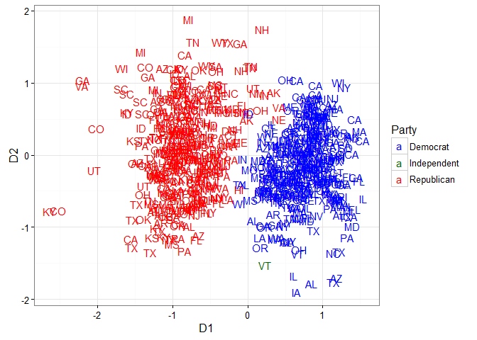
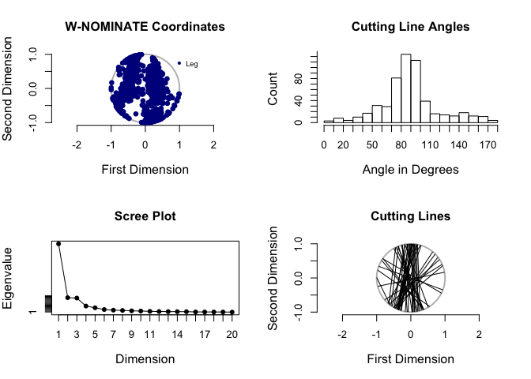
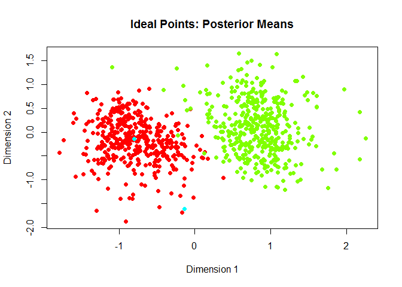

This package provides tools to query and download from the VoteView database. This vignette will demonstrate the different types of queries that can be used, how `Rvoteview` can be used to do ideal point estimation on a subset of votes using the `pscl` package and the `wnominate` package, and how `Rvoteview` facilitates regression analyses of congressional voting behavior.

1.  [Installation](#installation)
2.  [Querying the database with `voteview_search`](#querying-the-database-with-voteview_search)
3.  [Downloading roll call data with `voteview_download`](#downloading-roll-call-data%20with-voteview_download)
4.  [Additional Methods](#additional-methods)
    1.  [Joining two `rollcall` objects](#joining-two-rollcall-objects)
    2.  [Melting `rollcall` objects](#melting-rollcall-objects)
    3.  [Completing interrupted downloads](#completing-interrupted-downloads)
    4.  [Retrieving member data](#retrieving-member-data)
5.  [Extended Examples](#extended-examples)
    1.  [Ideal point estimation](#ideal-point-estimation)\]
    2.  [Regression analysis of roll call behavior](#regression-analysis-of-roll-call-behavior)

Installation
============

To install this package, ensure you have `devtools` installed. If you do not, run `install.packages("devtools")` and then install from GitHub using

``` r
devtools::install_github("voteview/Rvoteview")
```

For a quick start, see the README in the GitHub repository [here](https://github.com/voteview/Rvoteview).

Querying the database with `voteview_search`
============================================

The first main function of this package is to allow users to search for roll calls. Using a custom query parser, we allow both simple and complex queries to be made to the VoteView database. The simple way uses a set of arguments to build a query within the `R` package while the complex way allows the user to build a specific query with nested, boolean logic. Both can also be used simultaneously. You can find the full documentation for the query parser [here](https://github.com/voteview/Rvoteview/wiki/Query-Documentation).

Simple text queries
-------------------

The `q` argument should be treated similarly to a search box online. You can put in text search terms, specific fields with parameters, or it can be left blank if other arguments are used. The simple usage is to treat the `q` argument as a way to search all text fields. If you want to search a specific phrase, put the query in quotes. This will essentially look for that exact phrase in many of the text fields in the database. Alternatively, if you search without using quotes, the word will be lemmatized (shortened) and will search an index of the text fields. For example, we can search for "terrorism" exactly or loosely using the index:

``` r
library(Rvoteview)
res <- voteview_search("'terrorism'") # exact
res <- voteview_search("terrorism")   # index based
```

You can also search for multiple words:

``` r
res <- voteview_search("terrorism iraq") # index based search
```

Using the text index, the MongoDB that houses the rollcalls will search for the documents for either of these words and return the best matches. In effect, this will return documents that have *either* "terror" or "iraq" or various shortened versions of those words.

Basic syntax
------------

When using one of the simple queries above, the query parser automatically adds a field to the front of a query that does not specify which field to search. In order to specify a specific field, use the following `fieldname:query` syntax. To replicate the last example more explicitly, we use the following:

``` r
res <- voteview_search("alltext:terrorism iraq")
```

Unfortunately, due to the way the query parser works, you cannot search for two exact words at the moment or search in two different specific text fields. You can however look within a specific text field.

``` r
res <- voteview_search("vote_desc:'iraq'")
```

Using additional arguments
--------------------------

Users can also use other arguments to search only roll calls that are in a certain chamber of Congress, within a date range, within a certain set of congresses, and within a level of support, defined as the percent of total valid votes that were yea vote. This is especially useful if users only want to return competitive votes. Note that all fields are joined using "AND" logic; for example you search for roll calls using the keyword "tax" AND are in the House but not votes that either use the keyword "tax" OR were held in the House. Also note that the congress field uses "OR" logic within the numeric vector that specifices which congress to search. No roll call can be in two congresses, so it makes no sense to search for roll calls that are in one congress AND in another congress.

``` r
## Search for votes with a start date
## Note that because tax is not in quotes, it searches the text index and not for
## exact matches
res <- voteview_search("tax", startdate = "2005-01-01")
```

    #> Query '(tax) AND (startdate:2005-01-01)' returned 823 rollcalls...

``` r
## Search for votes with an end date in just the House
res <- voteview_search("tax", enddate = "2005-01-01", chamber = "House")
```

    #> Query '(tax) AND (enddate:2005-01-01) AND (chamber:house)' returned 1580 rollcalls...

``` r
## Search for votes with a start date in just the house in the 110th or 112th Congress
res <- voteview_search("tax",
                       startdate = "2000-12-20",
                       congress = c(110, 112),
                       chamber = "House")
```

    #> Query '(tax) AND (startdate:2000-12-20) AND (congress:110 112) AND (chamber:house)' returned 143 rollcalls...

You can always see exactly what search was used to create a set of roll calls by retrieving the 'qstring' attribute of the returned data frame:

``` r
attr(res, "qstring")
```

    #> [1] "(tax) AND (startdate:2000-12-20) AND (congress:110 112) AND (chamber:house)"

Building complex queries
------------------------

As previewed before, users can use the `q` argument to specify complex queries by specifying which fields to search and how to combine fields using boolean logic. The [complete documentation can be found here](https://github.com/voteview/Rvoteview/wiki/Query-Documentation). In general, the following syntax is used, `field:specific phrase (field:other phrase OR field:second phrase)`.

For example, if you wanted to find votes where 'war' and 'iraq' were present but only up to 1993 and after 2000, you could write it like so:

``` r
qString <- "alltext:war iraq (enddate:1993 OR startdate:2000)"
res <- voteview_search(q = qString)
```

    #> Query 'alltext:war iraq (enddate:1993 OR startdate:2000)' returned 2943 rollcalls...

Whenever in doubt, add parentheses to make the query clearer!

Numeric fields can be searched in a similar way, although users can also use square brackets and "to" for ranges of numbers. For example, the query for all votes about taxes in the 100th to 102nd congress could be expressed either using `"alltext:taxes congress:100 OR congress:101 OR congress:102"` or using `"alltext:taxes congress:[100 to 102]"`. Note that if you want to restrict search to certain dates, the `startdate` and `enddate` arguments in the function should be used.

For example, here is a query that will get votes from the 100 to 102nd congress on tax where the percent of the rollcall votes in favor will be between 45 and 55 percent, inclusive.

``` r
qString <- "alltext:tax iraq (congress:[100 to 102] AND support:[45 to 55])"
res <- voteview_search(q = qString)
```

    #> Query 'alltext:tax iraq (congress:[100 to 102] AND support:[45 to 55])' returned 36 rollcalls...

Downloading roll call data with `voteview_download`
===================================================

The second main function of this package is to allow users to download detailed roll call data into a modified `rollcall` object from the `pscl` package. The default usage is to pass `voteview_download` a vector of roll call id numbers that we return in the `voteview_search` function.

``` r
## Search all votes with the exact phrase "estate tax" in the 105th congress
res <- voteview_search("'estate tax' congress:105")

## Download all estate tax votes
rc <- voteview_download(res$id)

summary(rc)
```

    #> Source:       Download from VoteView 
    #> 
    #> Number of Legislators:        536
    #> Number of Roll Call Votes:    20
    #> 
    #> 
    #> Using the following codes to represent roll call votes:
    #> Yea:      1 2 3 
    #> Nay:      4 5 6 
    #> Abstentions:  7 8 9 
    #> Not In Legislature:   0 
    #> 
    #> Party Composition:
    #> 100 200 328 
    #> 252 283   1 
    #> 
    #> Vote Summary:
    #>                Count Percent
    #> 0 (notInLegis)  7696    71.8
    #> 1 (yea)         1339    12.5
    #> 6 (nay)         1645    15.3
    #> 7 (missing)        1     0.0
    #> 9 (missing)       39     0.4
    #> 
    #> Use summary(rc,verbose=TRUE) for more detailed information.

Importantly, the object we return is a modified `rollcall` object, in that it may contain additional elements that the authors of the `pscl` package did not include. Therefore it will work with all of the methods they wrote for `rollcall` objects as well as some methods we include in this package. The biggest difference between the original `rollcall` object and what we return is the inclusion of "long" versions of the `votes.data` and `legis.data` data frames, described below.

First, because icpsr numbers are not necessarily unique to legislators, we include `legis.long.dynamic` in the output. For example, when Strom Thurmond changed parties, his icpsr number also changed. However, when building rollcall objects, icpsr numbers are the default. Therefore, `legis.long.dynamic` contains a record of every legislator-party-congress as a unique id, as well as the relevant covariates.

Second, we include `votes.long`, a data frame where the rows are legislator-roll calls and contain how each legislator voted on each roll call. This is the long version of the `votes` matrix included in all `rollcall` objects.

Additional Methods
==================

We also add three methods that can be used on `rollcall` objects created by our package.

Joining two `rollcall` objects
------------------------------

The first function allows for a full outer join of two `rollcall` objects downloaded from the VoteView database, creating a new `rollcall` object that is a union of the two. It is called by using the `%+%` operator. This is especially useful if the user downloaded two roll call objects at separate times and wants to join them together rather than re-download all of the votes at the same time.

``` r
## Search all votes with exact phrase "estate tax"
res <- voteview_search("'estate tax' congress:105")

## Download first 10 votes
rc1 <- voteview_download(res$id[1:10])
## Download another 10 votes with some overlap
rc2 <- voteview_download(res$id[5:14])

## Merge them together
rcall <- rc1 %+% rc2

rcall$m # The number of total votes
```

    #> [1] 14

Melting `rollcall` objects
--------------------------

We also provide a function called `melt_rollcall` which allows users to produce a long data frame that is essentially the same as `votes.long` but includes all of the roll call and legislator data on each row.

``` r
## Default is to retain all data
rc_long <- melt_rollcall(rcall)
rc_long[1:3, 1:17]
```

    #>           id     vname vote rollnumber chamber       date congress
    #> 1 MH10502605 RH1050241    1        241   House 1997-06-26      105
    #> 2 MH10515401 RH1050241    6        241   House 1997-06-26      105
    #> 3 MH10529717 RH1050241    1        241   House 1997-06-26      105
    #>                               description                     question
    #> 1 Rangel of New York Substitute Amendment On Agreeing to the Amendment
    #> 2 Rangel of New York Substitute Amendment On Agreeing to the Amendment
    #> 3 Rangel of New York Substitute Amendment On Agreeing to the Amendment
    #>   yea_count nay_count vote_result                   codes.Issue
    #> 1       197       235      Failed Budget resolution ; Tax rates
    #> 2       197       235      Failed Budget resolution ; Tax rates
    #> 3       197       235      Failed Budget resolution ; Tax rates
    #>            codes.Peltzman         codes.Clausen nomslope nomintercept
    #> 1 Budget General Interest Government Management    5.347        0.495
    #> 2 Budget General Interest Government Management    5.347        0.495
    #> 3 Budget General Interest Government Management    5.347        0.495

``` r
## Retaining fewer columns
rc_long <- melt_rollcall(rcall, votecols = c("chamber", "congress"))
rc_long[1:3, ]
```

    #>           id     vname vote chamber congress icpsr
    #> 1 MH10502605 RH1050241    1   House      105  2605
    #> 2 MH10515401 RH1050241    6   House      105 15401
    #> 3 MH10529717 RH1050241    1   House      105 29717
    #>                       name party_code state_abbrev cqlabel district_code
    #> 1 DINGELL, John David, Jr.        100           MI (MI-16)            16
    #> 2      BAKER, Richard Hugh        200           LA (LA-06)             6
    #> 3          DAVIS, Danny K.        100           IL (IL-07)             7

Completing interrupted downloads
--------------------------------

If your internet connection drops in the middle of a download or you have to interrupt a download for some reason, the `voteview_download` function should try to complete building the `rollcall` object with whatever data it has successfully downloaded. While manually interrupting functions in `R` is tricky and we cannot catch interrupts perfectly, if it does succeed or if your connection does drop, then we store the roll call ids that you were unable to retrieve in the `unretrievedids` slot of our modified `rollcall` object. Users can then use the `complete_download` function to download the unretrieved ids and create a complete `rollcall` object. For example, imagine the following download stalls as your wireless cuts out at this cute coffee shop that has beans roasted in house but cannot manage a good wireless conenction:

``` r
rc_fail <- voteview_download(res$id)
```

If this fails but still manages to build a `rollcall` object with whatever ids it was able to retrieve, then we can complete the download with a simple command:

``` r
rc <- complete_download(rc_fail)
```

Again, because of the difficulty with properly catching interrupts in `R`, this will not always work with manual interrupts, but should work with dropped internet connections.

Retrieving member data
----------------------

There is also the ability to search the database for members (House Representatives, Senators, and Presidents) using the `member_search` function. Unfortunately, the syntax is not identical to the syntax when searching for roll calls. Nonetheless, the usage in `R` is quite simple. There are fields to search members' names, icpsr number, state (either ICPSR state number, two letter postal code, or the full name), the range of congresses to search within, the CQ label of the member, and the chamber to search within.

The function returns a data frame of metadata, with one row for each legislator-congress that is found (these are the unique entries in the database of members). Therefore, if we want to return all unique legislator-congresses where the name 'clinton' appears anywhere in the name fields, we can use the following search:

``` r
clintons <- member_search("clinton")

## Drop the bio field because it is quite long
clintons[1:7, names(clintons) != "bio"]
```

    #>           id icpsr                   bioname party_code cqlabel
    #> 1 MH00901849  1849           CLINTON, George         13 (NY-02)
    #> 2 MH05200311   311          BABBITT, Clinton        100 (WI-01)
    #> 3 MH00801849  1849           CLINTON, George         13 (NY-03)
    #> 4 MH01001849  1849           CLINTON, George         13 (NY-02)
    #> 5 MS00701847  1847          CLINTON, De Witt         13    (NY)
    #> 6 MH01806044  6044 MARTINDALE, Henry Clinton       8000 (NY-18)
    #> 7 MH01906044  6044 MARTINDALE, Henry Clinton         22 (NY-18)
    #>        bioImgURL congress     state state_abbrev chamber    score
    #> 1 silhouette.png        9  New York           NY   House 1.500000
    #> 2     000311.jpg       52 Wisconsin           WI   House 1.500000
    #> 3 silhouette.png        8  New York           NY   House 1.500000
    #> 4 silhouette.png       10  New York           NY   House 1.500000
    #> 5     001847.jpg        7  New York           NY  Senate 1.333333
    #> 6 silhouette.png       18  New York           NY   House 1.333333
    #> 7 silhouette.png       19  New York           NY   House 1.333333
    #>       congresses                 seo_name district_code
    #> 1          8, 10           george-clinton             2
    #> 2         52, 52          clinton-babbitt             1
    #> 3          8, 10           george-clinton             3
    #> 4          8, 10           george-clinton             2
    #> 5           7, 8          de-witt-clinton             0
    #> 6 18, 23, 21, 23 henry-clinton-martindale            18
    #> 7 18, 23, 21, 23 henry-clinton-martindale            18
    #>                    party_name nominate.dim2 nominate.dim1
    #> 1 Democratic-Republican Party         0.235         0.163
    #> 2            Democratic Party         0.125        -0.302
    #> 3 Democratic-Republican Party         0.235         0.163
    #> 4 Democratic-Republican Party         0.235         0.163
    #> 5 Democratic-Republican Party        -0.528        -0.366
    #> 6 Adams-Clay Federalist Party        -0.102         0.682
    #> 7                 Adams Party        -0.102         0.682
    #>   nominate.geo_mean_probability
    #> 1                         0.712
    #> 2                         0.645
    #> 3                            NA
    #> 4                            NA
    #> 5                         0.905
    #> 6                         0.712
    #> 7                         0.634

It is important to note that if there is no white space in the name field, the database is searched for exact matches for that one word. If there are multiple words we use a text index of all of the name fields and return the best matches.

If you only want to return the first record per ICPSR number, you can set the distinct flag equal to one. This is useful because it limits the size of the object returned and most data is duplicated within ICPSR number. For example, CS DW-NOMINATE scores are constant within ICPSR number, as are names and (usually) party.

``` r
clintons <- member_search("clinton",
                          state = "NY",
                          distinct = 1)

## Drop the bio field because it is quite long
clintons[, names(clintons) != "bio"]
```

    #>           id icpsr                     bioname party_code cqlabel
    #> 1 MH00901849  1849             CLINTON, George         13 (NY-02)
    #> 2 MS00701847  1847            CLINTON, De Witt         13    (NY)
    #> 3 MH01806044  6044   MARTINDALE, Henry Clinton       8000 (NY-18)
    #> 4 MH02701850  1850       CLINTON, James Graham        100 (NY-06)
    #> 5 MH04206426  6426       MERRIAM, Clinton Levi        200 (NY-20)
    #> 6 MH04305875  5875  MacDOUGALL, Clinton Dugald        200 (NY-25)
    #> 7 MS10740105 40105     CLINTON, Hillary Rodham        100    (NY)
    #> 8 MH03805707  5707 LITTLEJOHN, De Witt Clinton        200 (NY-22)
    #>        bioImgURL congress    state state_abbrev chamber    score
    #> 1 silhouette.png        9 New York           NY   House 1.500000
    #> 2     001847.jpg        7 New York           NY  Senate 1.333333
    #> 3 silhouette.png       18 New York           NY   House 1.333333
    #> 4 silhouette.png       27 New York           NY   House 1.333333
    #> 5     006426.jpg       42 New York           NY   House 1.333333
    #> 6 silhouette.png       43 New York           NY   House 1.333333
    #> 7     040105.jpg      107 New York           NY  Senate 1.333333
    #> 8     005707.jpg       38 New York           NY   House 1.250000
    #>       congresses                   seo_name district_code
    #> 1          8, 10             george-clinton             2
    #> 2           7, 8            de-witt-clinton             0
    #> 3 18, 23, 21, 23   henry-clinton-martindale            18
    #> 4         27, 28       james-graham-clinton             6
    #> 5         42, 43       clinton-levi-merriam            20
    #> 6         43, 44  clinton-dugald-macdougall            25
    #> 7       107, 111     hillary-rodham-clinton             0
    #> 8         38, 38 de-witt-clinton-littlejohn            22
    #>                    party_name nominate.dim2 nominate.dim1
    #> 1 Democratic-Republican Party         0.235         0.163
    #> 2 Democratic-Republican Party        -0.528        -0.366
    #> 3 Adams-Clay Federalist Party        -0.102         0.682
    #> 4            Democratic Party        -0.694        -0.262
    #> 5            Republican Party        -0.774         0.353
    #> 6            Republican Party        -0.463         0.453
    #> 7            Democratic Party        -0.243        -0.367
    #> 8            Republican Party         0.474         0.454
    #>   nominate.geo_mean_probability
    #> 1                         0.712
    #> 2                         0.905
    #> 3                         0.712
    #> 4                         0.789
    #> 5                         0.679
    #> 6                         0.699
    #> 7                         0.833
    #> 8                         0.729

Some other fields that are not unique to ICPSR number but may vary are the chamber of the representative, their CQ label, and the number of votes they cast. Let's get all the records for Bernie Sanders.

``` r
sanders <- member_search("sanders",
                         state = "VT")

## Drop the bio field because it is quite long
sanders[, names(sanders) != "bio"]
```

    #>            id icpsr          bioname party_code cqlabel  bioImgURL
    #> 1  MH10229147 29147 SANDERS, Bernard        328 (VT-01) 029147.jpg
    #> 2  MH10329147 29147 SANDERS, Bernard        328 (VT-01) 029147.jpg
    #> 3  MH10429147 29147 SANDERS, Bernard        328 (VT-01) 029147.jpg
    #> 4  MH10529147 29147 SANDERS, Bernard        328 (VT-01) 029147.jpg
    #> 5  MH10629147 29147 SANDERS, Bernard        328 (VT-01) 029147.jpg
    #> 6  MH10729147 29147 SANDERS, Bernard        328 (VT-01) 029147.jpg
    #> 7  MH10829147 29147 SANDERS, Bernard        328 (VT-01) 029147.jpg
    #> 8  MH10929147 29147 SANDERS, Bernard        328 (VT-01) 029147.jpg
    #> 9  MS11029147 29147 SANDERS, Bernard        328    (VT) 029147.jpg
    #> 10 MS11129147 29147 SANDERS, Bernard        328    (VT) 029147.jpg
    #> 11 MS11229147 29147 SANDERS, Bernard        328    (VT) 029147.jpg
    #> 12 MS11329147 29147 SANDERS, Bernard        328    (VT) 029147.jpg
    #> 13 MS11429147 29147 SANDERS, Bernard        328    (VT) 029147.jpg
    #> 14 MS11529147 29147 SANDERS, Bernard        328    (VT) 029147.jpg
    #>    congress   state state_abbrev chamber score congresses        seo_name
    #> 1       102 Vermont           VT   House   1.5   102, 115 bernard-sanders
    #> 2       103 Vermont           VT   House   1.5   102, 115 bernard-sanders
    #> 3       104 Vermont           VT   House   1.5   102, 115 bernard-sanders
    #> 4       105 Vermont           VT   House   1.5   102, 115 bernard-sanders
    #> 5       106 Vermont           VT   House   1.5   102, 115 bernard-sanders
    #> 6       107 Vermont           VT   House   1.5   102, 115 bernard-sanders
    #> 7       108 Vermont           VT   House   1.5   102, 115 bernard-sanders
    #> 8       109 Vermont           VT   House   1.5   102, 115 bernard-sanders
    #> 9       110 Vermont           VT  Senate   1.5   102, 115 bernard-sanders
    #> 10      111 Vermont           VT  Senate   1.5   102, 115 bernard-sanders
    #> 11      112 Vermont           VT  Senate   1.5   102, 115 bernard-sanders
    #> 12      113 Vermont           VT  Senate   1.5   102, 115 bernard-sanders
    #> 13      114 Vermont           VT  Senate   1.5   102, 115 bernard-sanders
    #> 14      115 Vermont           VT  Senate   1.5   102, 115 bernard-sanders
    #>    district_code  party_name nominate.dim2 nominate.dim1
    #> 1              1 Independent        -0.323        -0.516
    #> 2              1 Independent        -0.323        -0.516
    #> 3              1 Independent        -0.323        -0.516
    #> 4              1 Independent        -0.323        -0.516
    #> 5              1 Independent        -0.323        -0.516
    #> 6              1 Independent        -0.323        -0.516
    #> 7              1 Independent        -0.323        -0.516
    #> 8              1 Independent        -0.323        -0.516
    #> 9              0 Independent        -0.323        -0.516
    #> 10             0 Independent        -0.323        -0.516
    #> 11             0 Independent        -0.323        -0.516
    #> 12             0 Independent        -0.323        -0.516
    #> 13             0 Independent        -0.323        -0.516
    #> 14             0 Independent        -0.323        -0.516
    #>    nominate.geo_mean_probability
    #> 1                      0.7602263
    #> 2                      0.8082525
    #> 3                      0.8195841
    #> 4                      0.7916307
    #> 5                      0.8055633
    #> 6                      0.8127989
    #> 7                      0.8060040
    #> 8                      0.8439096
    #> 9                      0.8814125
    #> 10                     0.8918629
    #> 11                     0.7792373
    #> 12                     0.8365333
    #> 13                     0.7983794
    #> 14                     0.8733797

As you can see Sanders changes chambers between the 109th and 110th congresses and a few other fields differ as well. Nonetheless, most is repeated.

Extended Examples
=================

This section details three different possible uses of the `Rvoteview` package, showing users from beginning to end how to conduct their own ideal point estimation and use `Rvoteview` in more traditional regression analysis.

Ideal point estimation
----------------------

Imagine that we want to estimate ideal points for all legislators voting on foreign policy during the first six months of Obama's presidency.. We will use all roll calls that fit the Clausen category "Foreign and Defense Policy" and are somewhat competitive, meaning between 15 and 85 percent of votes on the floor were yeas.

``` r
## Load packages
library(ggplot2)   # Load this first so that Rvoteview can use %+%
```

    #> Find out what's changed in ggplot2 at
    #> http://github.com/tidyverse/ggplot2/releases.

    #> 
    #> Attaching package: 'ggplot2'

    #> The following object is masked from 'package:Rvoteview':
    #> 
    #>     %+%

``` r
library(Rvoteview)

## Search database for votes that meet our criteria
res <- voteview_search("codes.Clausen:Foreign and Defense Policy support:[15 to 85]",
                       startdate = "2009-01-20", enddate = "2009-07-20")
```

    #> Query '(codes.Clausen:Foreign and Defense Policy support:[15 to 85]) AND (startdate:2009-01-20) AND (enddate:2009-07-20)' returned 74 rollcalls...

``` r
## Download votes into rollcall object
rc <- voteview_download(res$id)
```

``` r
summary(rc)
```

    #> Source:       Download from VoteView 
    #> 
    #> Number of Legislators:        734
    #> Number of Roll Call Votes:    555
    #> 
    #> 
    #> Using the following codes to represent roll call votes:
    #> Yea:      1 2 3 
    #> Nay:      4 5 6 
    #> Abstentions:  7 8 9 
    #> Not In Legislature:   0 
    #> 
    #> Party Composition:
    #> 100 200 328 
    #> 359 374   1 
    #> 
    #> Vote Summary:
    #>                 Count Percent
    #> 0 (notInLegis) 212005    52.0
    #> 1 (yea)         92810    22.8
    #> 6 (nay)         95350    23.4
    #> 7 (missing)       246     0.1
    #> 9 (missing)      6959     1.7
    #> 
    #> Use summary(rc,verbose=TRUE) for more detailed information.

Now we use the `wnominate` package to run an ideal point estimation.

``` r
library(wnominate)
```

    #> 
    #> ## W-NOMINATE Ideal Point Package

    #> ## Copyright 2006 -2018

    #> ## Keith Poole, Jeffrey Lewis, James Lo, and Royce Carroll

    #> ## Support provided by the U.S. National Science Foundation

    #> ## NSF Grant SES-0611974

``` r
# Find extreme legislators for polarity argument
cons1 <- rc$legis.long.dynamic[which.max(rc$legis.data$dim1), c("name", "icpsr")]
cons2 <- rc$legis.long.dynamic[which.max(rc$legis.data$dim2), c("name", "icpsr")]
defIdeal <- wnominate(rc,
                      polarity = list("icpsr", c(20753, 20523)))
```

    #> 
    #> Preparing to run W-NOMINATE...
    #> 
    #>  Checking data...
    #> 
    #>      ... 9 of 734 total members dropped.
    #> 
    #>      All votes meet minimum lopsidedness requirement.
    #> 
    #>  Running W-NOMINATE...
    #> 
    #>      Getting bill parameters...
    #>      Getting legislator coordinates...
    #>      Starting estimation of Beta...
    #>      Getting bill parameters...
    #>      Getting legislator coordinates...
    #>      Starting estimation of Beta...
    #>      Getting bill parameters...
    #>      Getting legislator coordinates...
    #>      Getting bill parameters...
    #>      Getting legislator coordinates...
    #>      Estimating weights...
    #>      Getting bill parameters...
    #>      Getting legislator coordinates...
    #>      Estimating weights...
    #>      Getting bill parameters...
    #>      Getting legislator coordinates...
    #> 
    #> 
    #> W-NOMINATE estimation completed successfully.
    #> W-NOMINATE took 210.619 seconds to execute.

This ideal point estimation also returns the estimated points attached the all of the legislator and rollcall metadata already in the `rc` object! This can be useful in creating custom plots.

``` r
## Create text party name
defIdeal$legislators$partyName <- ifelse(defIdeal$legislators$party == 200, "Republican",
                                  ifelse(defIdeal$legislators$party == 100, "Democrat", "Independent"))

ggplot(defIdeal$legislators,
       aes(x=coord1D, y=coord2D, color=partyName, label=state_abbrev)) +
  geom_text() +
  scale_color_manual("Party", values = c("Republican" = "red",
                                         "Democrat" = "blue",
                                         "Independent" = "darkgreen")) +
  theme_bw()
```

    #> Warning: Removed 9 rows containing missing values (geom_text).



We see the usual split between Republicans and Democrats.

We can also use the build in `plot` method from \`wnominate to produce some great figures from our estimation.

``` r
# Some great plots!
plot(defIdeal)
```



    #> NULL

The `rollcall` objects we build can also be used in the `ideal` function in the `pscl` package.

``` r
library(pscl)
defIdeal <- ideal(rc,
                  d = 2)
```

We can also use the `pscl` plot method.

``` r
plot(defIdeal)
```



Regression analysis of roll call behavior
-----------------------------------------

Users can also use the VoteView API to run regression analyses. Let's take the state level opinion data on gay rights that was estimated in [Lax and Phillips (2009)](http://dx.doi.org/10.1017/S0003055409990050). They used multilevel regression and poststratification on surveys from 1999-2008 in order to estimate state-level explicit support for gay rights issues. Let's pull down some important bills presented before the 111th congress (2009-2011) and see how state level public opinion in the preceding years predicts voting behavior in the legislature.

Let's see what bills there were in the 111th congress that had to do with homosexuality. We can use a search that will capture quite a few different bills.

``` r
## Two separate searches because fields cannot be joined with an OR
res <- voteview_search("codes.Issue:Homosexuality congress:111")
```

    #> Query 'codes.Issue:Homosexuality congress:111' returned 18 rollcalls...

``` r
res[1:5, 1:10]
```

    #>          id congress chamber rollnumber       date yea nay support
    #> 1 RH1110218      111   House        218 2009-04-29 234 181   56.39
    #> 2 RH1110219      111   House        219 2009-04-29 234 190   55.19
    #> 3 RH1110221      111   House        221 2009-04-29 185 241   43.43
    #> 4 RH1110222      111   House        222 2009-04-29 249 175   58.73
    #> 5 RH1110752      111   House        752 2009-10-06 178 234   43.20
    #>   vote_result       short_description
    #> 1      Passed      HATE CRIMES (PROC)
    #> 2      Passed     HATE CRIMES -- RULE
    #> 3      Failed HATE CRIMES -- RECOMMIT
    #> 4      Passed      HATE CRIMES (PASS)
    #> 5      Failed      HATE CRIMES (PROC)

To focus on actual bills that were of some consequence, let's take the House and Senate don't ask don't tell votes and the hate crimes bill from the House.

``` r
dadt <- voteview_download(c("RH1111621", "RS1110678", "RH1110222"))
dadt$vote.data
```

Now we want to turn this into a long dataframe, where each row is a legislator-vote. We could also then cast this using a standard cast function or the `reshape2` package to have each row be a legislator, or each row be a legislator-congress and so on. The longer format will serve our purposes for now. Note that `dim1` and `dim2` are the Common Space DW-Nominate positions on the first and second ideological dimensions. They are fixed over the legislator's tenure in office.

``` r
## Only retain certain columns with respect to the legislator and the vote
dadtLong <- melt_rollcall(dadt,
                          legiscols = c("name", "state_abbrev","party_code", "dim1", "dim2"),
                          votecols = c("vname", "date", "chamber"))
head(dadtLong)
```

    #>           id     vname vote chamber       date                     name
    #> 1 MH11102605 RH1111621    1   House 2010-12-15 DINGELL, John David, Jr.
    #> 2 MH11115627 RH1111621    6   House 2010-12-15  STEARNS, Clifford Bundy
    #> 3 MH11129149 RH1111621    1   House 2010-12-15          MORAN, James P.
    #> 4 MH11110713 RH1111621    1   House 2010-12-15       CONYERS, John, Jr.
    #> 5 MH11112036 RH1111621    1   House 2010-12-15         OBEY, David Ross
    #> 6 MH11115634 RH1111621    1   House 2010-12-15     ROS-LEHTINEN, Ileana
    #>   party_code state_abbrev   dim2   dim1
    #> 1        100           MI  0.313 -0.448
    #> 2        200           FL -0.075  0.554
    #> 3        100           VA -0.203 -0.302
    #> 4        100           MI -0.512 -0.658
    #> 5        100           WI -0.063 -0.450
    #> 6        200           FL -0.225  0.245

Included in the package is a dataframe that links the numeric ICPSR codes to state names and state mail codes. You can load the data by calling `data(states)`. We use this to merge in the proper state names that will be matched to the Lax and Phillips (2009) dataset. Obama appears three times in this dataset and will be dropped in this merge.

``` r
data(states)
dadtLong <- merge(dadtLong, states[, c("state_abbrev", "state_name")],
                  by = "state_abbrev")

dadtLong$state_name <- tolower(dadtLong$state_name)
```

Now we use the Lax and Phillips (2009) data, which we make available in the package as well under `lpOpinion`.

``` r
data(lpOpinion)
lpOpinion$state <- tolower(lpOpinion$state)

df <- merge(dadtLong, lpOpinion,
            by.x = "state_name", by.y = "state")
head(df)
```

    #>   state_name state_abbrev         id     vname vote chamber       date
    #> 1    alabama           AL MH11120901 RH1110222    6   House 2009-04-29
    #> 2    alabama           AL MH11120301 RH1110222    6   House 2009-04-29
    #> 3    alabama           AL MH11120300 RH1111621    6   House 2010-12-15
    #> 4    alabama           AL MH11120301 RH1111621    6   House 2010-12-15
    #> 5    alabama           AL MH11120900 RH1110222    6   House 2009-04-29
    #> 6    alabama           AL MH11120302 RH1110222    6   House 2009-04-29
    #>                              name party_code  dim2   dim1
    #> 1                GRIFFITH, Parker        100 0.522 -0.045
    #> 2             ROGERS, Mike Dennis        200 0.443  0.338
    #> 3 BONNER, Jr., Josiah Robins (Jo)        200 0.513  0.367
    #> 4             ROGERS, Mike Dennis        200 0.443  0.338
    #> 5         BRIGHT, Bobby Neal, Sr.        100 0.671  0.067
    #> 6                    DAVIS, Artur        100 0.454 -0.270
    #>   secondParentAdoption hateCrimes healthBenefits housing jobs marriage
    #> 1                   29         61             54      68   53       23
    #> 2                   29         61             54      68   53       23
    #> 3                   29         61             54      68   53       23
    #> 4                   29         61             54      68   53       23
    #> 5                   29         61             54      68   53       23
    #> 6                   29         61             54      68   53       23
    #>   sodomy civilUnions meanOpinion
    #> 1     28          34          44
    #> 2     28          34          44
    #> 3     28          34          44
    #> 4     28          34          44
    #> 5     28          34          44
    #> 6     28          34          44

Now let's build a dichotomous variable that represents whether the legislator voted yea on that bill (1), nay on that bill (0), or abstained (NA).

``` r
## Recode votes
df$voteYes <- ifelse(df$vote == 1, 1, ifelse(df$vote == 6, 0, NA))

## Raw votes by party
table(df$party_code, df$voteYes, useNA = "always")
```

    #>       
    #>          0   1 <NA>
    #>   100   32 522   14
    #>   200  349  41    9
    #>   328    0   1    0
    #>   <NA>   0   0    0

``` r
## Recode party (add independent to democrats)
df$republican <- ifelse(df$party_code == "200", 1, 0)
```

Let's use `meanOpinion` from the Lax and Phillips (2009) data, which is the average of pro-gay public opinion sentiment on various dimensions. We will use it in a couple of analyses.

``` r
## Simple model
summary(lm(voteYes ~ meanOpinion, data = df))
```

    #> 
    #> Call:
    #> lm(formula = voteYes ~ meanOpinion, data = df)
    #> 
    #> Residuals:
    #>     Min      1Q  Median      3Q     Max 
    #> -0.8823 -0.4151  0.1488  0.3669  0.9899 
    #> 
    #> Coefficients:
    #>              Estimate Std. Error t value Pr(>|t|)    
    #> (Intercept) -1.173622   0.125685  -9.338   <2e-16 ***
    #> meanOpinion  0.031151   0.002197  14.181   <2e-16 ***
    #> ---
    #> Signif. codes:  0 '***' 0.001 '**' 0.01 '*' 0.05 '.' 0.1 ' ' 1
    #> 
    #> Residual standard error: 0.4458 on 943 degrees of freedom
    #>   (23 observations deleted due to missingness)
    #> Multiple R-squared:  0.1758, Adjusted R-squared:  0.1749 
    #> F-statistic: 201.1 on 1 and 943 DF,  p-value: < 2.2e-16

``` r
## Control for party
summary(lm(voteYes ~ meanOpinion*republican, data = df))
```

    #> 
    #> Call:
    #> lm(formula = voteYes ~ meanOpinion * republican, data = df)
    #> 
    #> Residuals:
    #>      Min       1Q   Median       3Q      Max 
    #> -0.93523 -0.07432 -0.02396  0.07956  0.95041 
    #> 
    #> Coefficients:
    #>                         Estimate Std. Error t value Pr(>|t|)    
    #> (Intercept)             0.077450   0.099228   0.781    0.435    
    #> meanOpinion             0.014789   0.001687   8.767  < 2e-16 ***
    #> republican             -0.645973   0.149434  -4.323  1.7e-05 ***
    #> meanOpinion:republican -0.002427   0.002645  -0.918    0.359    
    #> ---
    #> Signif. codes:  0 '***' 0.001 '**' 0.01 '*' 0.05 '.' 0.1 ' ' 1
    #> 
    #> Residual standard error: 0.2518 on 941 degrees of freedom
    #>   (23 observations deleted due to missingness)
    #> Multiple R-squared:  0.7377, Adjusted R-squared:  0.7369 
    #> F-statistic: 882.3 on 3 and 941 DF,  p-value: < 2.2e-16

``` r
## Control for ideology
## Note that ideology here has been estimated using these and later votes,
## so interpret the results with some caution
summary(lm(voteYes ~ meanOpinion*republican + dim1 + dim2,
           data = df))
```

    #> 
    #> Call:
    #> lm(formula = voteYes ~ meanOpinion * republican + dim1 + dim2, 
    #>     data = df)
    #> 
    #> Residuals:
    #>      Min       1Q   Median       3Q      Max 
    #> -0.79008 -0.10750 -0.01185  0.07428  0.93117 
    #> 
    #> Coefficients:
    #>                         Estimate Std. Error t value Pr(>|t|)    
    #> (Intercept)             0.614458   0.104153   5.900 5.08e-09 ***
    #> meanOpinion             0.003512   0.001802   1.949   0.0516 .  
    #> republican             -0.700580   0.143866  -4.870 1.31e-06 ***
    #> dim1                   -0.374958   0.056626  -6.622 5.97e-11 ***
    #> dim2                   -0.270507   0.029114  -9.291  < 2e-16 ***
    #> meanOpinion:republican  0.003193   0.002487   1.284   0.1995    
    #> ---
    #> Signif. codes:  0 '***' 0.001 '**' 0.01 '*' 0.05 '.' 0.1 ' ' 1
    #> 
    #> Residual standard error: 0.2329 on 939 degrees of freedom
    #>   (23 observations deleted due to missingness)
    #> Multiple R-squared:  0.776,  Adjusted R-squared:  0.7748 
    #> F-statistic: 650.6 on 5 and 939 DF,  p-value: < 2.2e-16

``` r
## Now let's look just at repealing don't ask don't tell and add chamber fixed effects
summary(lm(voteYes ~ meanOpinion*republican + dim1 + dim2 + chamber,
           data = df[df$vname != "RH1110222", ]))
```

    #> 
    #> Call:
    #> lm(formula = voteYes ~ meanOpinion * republican + dim1 + dim2 + 
    #>     chamber, data = df[df$vname != "RH1110222", ])
    #> 
    #> Residuals:
    #>      Min       1Q   Median       3Q      Max 
    #> -0.79241 -0.10385 -0.01139  0.07537  0.89854 
    #> 
    #> Coefficients:
    #>                         Estimate Std. Error t value Pr(>|t|)    
    #> (Intercept)             0.756861   0.139289   5.434 8.53e-08 ***
    #> meanOpinion             0.001755   0.002402   0.731  0.46541    
    #> republican             -0.986845   0.189052  -5.220 2.60e-07 ***
    #> dim1                   -0.246299   0.074859  -3.290  0.00107 ** 
    #> dim2                   -0.291247   0.038538  -7.557 1.90e-13 ***
    #> chamberSenate           0.062868   0.026494   2.373  0.01802 *  
    #> meanOpinion:republican  0.006346   0.003275   1.938  0.05318 .  
    #> ---
    #> Signif. codes:  0 '***' 0.001 '**' 0.01 '*' 0.05 '.' 0.1 ' ' 1
    #> 
    #> Residual standard error: 0.2268 on 514 degrees of freedom
    #>   (13 observations deleted due to missingness)
    #> Multiple R-squared:  0.7877, Adjusted R-squared:  0.7852 
    #> F-statistic: 317.8 on 6 and 514 DF,  p-value: < 2.2e-16

Even when controlling for ideology and party, it seems that legislators, and especially Republican legislators, are more likely to vote for pro-gay rights bills when their state has a high average level of pro-gay rights sentiment.
