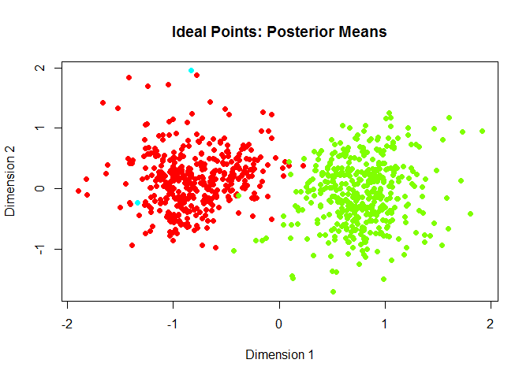
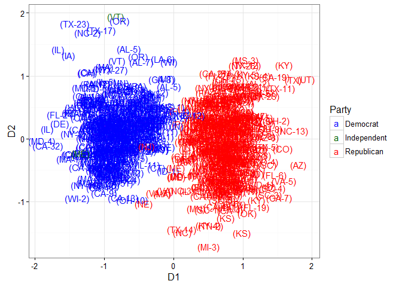
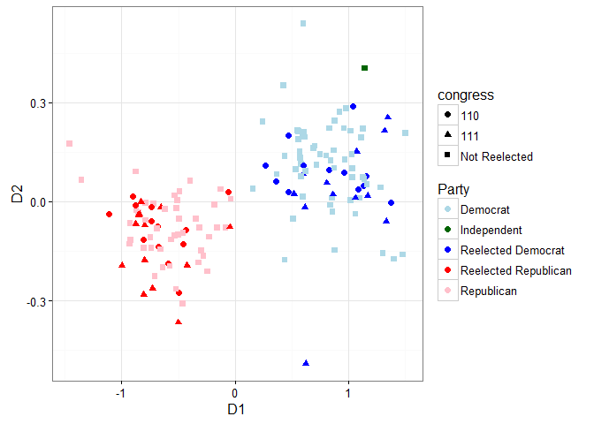

This package provides tools to query and download from the VoteView database. This vignette will demonstrate the different types of queries that can be used, how `Rvoteview` can be used to do ideal point estimation on a subset of votes using the `pscl` package, and how `Rvoteview` facilitates regression analyses of congressional voting behavior.

Installation
============

To install this package, ensure you have `devtools` installed. If you do not, run `install.packages("devtools")` and then install from GitHub using

``` r
devtools::install_github("JeffreyBLewis/Rvoteview")
```

For a quick start, see the README in the GitHub repository [here](https://github.com/JeffreyBLewis/Rvoteview).

Querying the database with `voteview_search`
============================================

The first main function of this package is to allow users to search for roll calls. Using a custom query parser, we allow both simple and complex queries to be made to the VoteView database. The simple way uses a set of arguments to build a query within the `R` package while the complex way allows the user to build a specific query with nested, boolean logic. Both can also be used simultaneously.

Simple text queries
-------------------

The `q` argument should be treated similarly to a search box online. You can put in text search terms, specific fields with parameters, or it can be left blank if other arguments are used. The simple usage is to treat the `q` argument as a way to search all text fields. If you want to search a specific phrase, put the query in quotes. This will essentially look for that exact phrase in any of the text fields in the database. Alternatively, if you search without using quotes, the word will be lemmatized (shortened) and will search an index of the text fields. For example, we can search for "terrorism" exactly or loosely using the index:

``` r
library(Rvoteview)
res <- voteview_search("'terrorism'")
## 164 found rollcalls
res <- voteview_search("terrorism")
## 238 found rollcalls
```

You can also search for multiple words:

``` r
res <- voteview_search("terrorism iraq")
## 546 found rollcalls
```

Using the text index, the MongoDB that houses the rollcalls will search for the documents for either of these words and return the best matches. In effect, this will return documents that have *either* "terror" or "iraq" or various shortened versions of those words.

Basic syntax
------------

When using one of the simple queries above, the query parser automatically adds a field to the front of a query that does not specify which field to search. In order to specify a specific field, use the following `fieldname:query` syntax. To replicate the last example more explicitly, we use the following:

``` r
res <- voteview_search("alltext:terrorism iraq")
## 546 found rollcalls
```

Unfortunately, due to the way the text index works, to search for documents that have both "terror" *and* "iraq" will require some more work. One way to do this is to search a specific text field more than once, as queries across fields will be joined by AND by default:

``` r
res <- voteview_search("description:'terror' description:'iraq'")
## 11 found rollcalls
```

Unfortunately, the full text index cannot be accessed more than once at a time. That means that you cannot have two text fields that you search without quotes. Thus, `"description:iraq description:terror"` will not work and neither will `"alltext:iraq alltext:terror"`.

Using additional arguments
--------------------------

Users can also use other arguments to search only roll calls that are in a certain chamber of Congress, within a date range, within a certain set of congresses, and within a level of support, defined as the percent of total valid votes that were yea vote. This is especially useful if users only want to return competitive votes. Note that all fields are joined using "AND" logic; for example you search for roll calls using the keyword "tax" AND are in the House but not votes that either use the keyword "tax" OR were held in the House. Also note that the congress field uses "OR" logic within the numeric vector that specifices which congress to search. No roll call can be in two congresses, so it makes no sense to search for roll calls that are in one congress AND in another congress.

``` r
## Search for votes with a start date
## Note that because tax is not in quotes, it searches the text index and not for
## exact matches
res <- voteview_search("tax", startdate = "2005-01-01")

## Search for votes with an end date in just the House
res <- voteview_search("tax", enddate = "2005-01-01", chamber = "House")

## Search for votes with a start date in just the house in the 110th or 112th Congress
res <- voteview_search("tax",
                       startdate = "2000-12-20",
                       congress = c(110, 112),
                       chamber = "House")
```

Building complex queries
------------------------

As previewed before, users can use the `q` argument to specify complex queries by specifying which fields to search and how to combine fields using boolean logic. The complete documentation is forthcoming. In general, the following syntax is used, `field:specific phrase (field:other phrase OR field:second phrase)`.

For example, if you wanted to find votes with "war" and either "iraq" or "afghanistan" in the description field, you could set the query to:

``` r
qString <- "description:'war' (description:'iraq' OR description:'afghanistan')"
res <- voteview_search(q = qString)
```

Numeric fields can be searched in a similar way, although users can also use square brackets and "to" for ranges of numbers. For example, the query for all votes about taxes in the 100th to 102nd congress could be expressed either using `"alltext:taxes congress:100 OR congress:101 OR congress:102"` or using `"alltext:taxes congress:[100 to 102]"`. Note that if you want to restrict search to certain dates, the `startdate` and `enddate` arguments in the function should be used.

For example,

``` r
## Search for "war" AND ("iraq" or "afghanistan") in the description field in 2003
res <- voteview_search(q = qString,
                       startdate = "2003-01-01",
                       enddate = "2003-12-31")
```

The fields that can be searched with text are `codes`, `code.Clausen`, `code.Peltzman`, `code.Issue`, `description`, `shortdescription`, `bill`, and `alltext`. The fields that can be searched by number are `congress`, `yea`, `nay`, and `support`. Searching by individual legislator will be implemented soon.

Downloading roll call data with `voteview_download`
===================================================

The second main function of this package is to allow users to download detailed roll call data into a modified `rollcall` object from the `pscl` package. The default usage is to pass `voteview_download` a vector of roll call id numbers that we return in the `voteview_search` function.

``` r
## Search all votes with the exact phrase "estate tax"
res <- voteview_search("'estate tax'")

## Download all estate tax votes
rc <- voteview_download(res$id)

summary(rc)
```

    #> Source:       Download from VoteView 
    #> 
    #> Number of Legislators:        1690
    #> Number of Roll Call Votes:    56
    #> 
    #> 
    #> Using the following codes to represent roll call votes:
    #> Yea:      1 2 3 
    #> Nay:      4 5 6 
    #> Abstentions:  7 8 9 
    #> Not In Legislature:   0 
    #> 
    #> Party Composition:
    #>  100  112  200  328  537 <NA> 
    #>  921    1  764    3    1    0 
    #> 
    #> Vote Summary:
    #>                Count Percent
    #> 0 (notInLegis) 83362    88.1
    #> 1 (yea)         5772     6.1
    #> 2 (yea)           27     0.0
    #> 3 (yea)           33     0.0
    #> 4 (nay)           17     0.0
    #> 5 (nay)           29     0.0
    #> 6 (nay)         4887     5.2
    #> 7 (missing)       30     0.0
    #> 9 (missing)      483     0.5
    #> 
    #> Use summary(rc,verbose=TRUE) for more detailed information.

Importantly, the object we return is a modified `rollcall` object, in that it may contain additional elements that the authors of the `pscl` package did not include. Therefore it will work with all of the methods they wrote for `rollcall` objects as well as some methods we include in this package. The biggest difference between the original `rollcall` object and what we return is the inclusion of "long" versions of the `votes.data` and `legis.data` data frames, described below.

First, because icpsr numbers are not necessarily unique to legislators, we include `legis.long.dynamic` in the output. For example, when Strom Thurmond changed parties, his icpsr number also changed. However, when building rollcall objects, icpsr numbers are the default. Therefore, `legis.long.dynamic` contains a record of every legislator-party-congress as a unique id, as well as the relevant covariates.

Second, we include `votes.long`, a data frame where the rows are legislator-roll calls and contain how each legislator voted on each roll call. This is the long version of the `votes` matrix included in all `rollcall` objects.

Additional Methods
==================

We also add two methods that can be used on `rollcall` objects created by our package.

Joining two `rollcall` objects
------------------------------

The first function allows for a full outer join of two `rollcall` objects downloaded from the VoteView database, creating a new `rollcall` object that is a union of the two. It is called by using the `%+%` operator. This is especially useful if the user downloaded two roll call objects at separate times and wants to join them together rather than re-download all of the votes at the same time.

``` r
## Search all votes with exact phrase "estate tax"
res <- voteview_search("'estate tax'")

## Download first 10 votes
rc1 <- voteview_download(res$id[1:10])
## Download another 10 votes with some overlap
rc2 <- voteview_download(res$id[5:14])

## Merge them together
rcall <- rc1 %+% rc2

rcall$m # The number of total votes
```

    #> [1] 14

Melting `rollcall` objects
--------------------------

We also provide a function called `melt_rollcall` which allows users to produce a long data frame that is essentially the same as `votes.long` but includes all of the roll call and legislator data on each row.

``` r
## Default is to retain all data
rc_long <- melt_rollcall(rcall)
rc_long[1:3, ]
```

    #>           id vote    vname rollnumber chamber       date congress
    #> 1 MH99903088    1 S0880411        411  Senate 1964-06-23       88
    #> 2 MS04382088    1 S0880411        411  Senate 1964-06-23       88
    #> 3 MS05500088    1 S0880411        411  Senate 1964-06-23       88
    #>                     code.Issue              code.Peltzman
    #> 1 Fish and Wildlife; Tax rates Foreign Policy Resolutions
    #> 2 Fish and Wildlife; Tax rates Foreign Policy Resolutions
    #> 3 Fish and Wildlife; Tax rates Foreign Policy Resolutions
    #>                 code.Clausen
    #> 1 Foreign and Defense Policy
    #> 2 Foreign and Defense Policy
    #> 3 Foreign and Defense Policy
    #>                                                                                                                                                                                                                              description
    #> 1 EXECS A AND B, 88TH CONG., 2ND SESS. EXEC A REVISED THE 1950 ESTATE TAX CONVENTION BETWEN THE U.S. AND GREECE.  EXEC B BROUGHT HARP & HOOD SEALS UNDER CONSERVATION PROVISIONS OF THE NORTHWEST ATLANTIC FISHERIES CONVENTION OF 1949.
    #> 2 EXECS A AND B, 88TH CONG., 2ND SESS. EXEC A REVISED THE 1950 ESTATE TAX CONVENTION BETWEN THE U.S. AND GREECE.  EXEC B BROUGHT HARP & HOOD SEALS UNDER CONSERVATION PROVISIONS OF THE NORTHWEST ATLANTIC FISHERIES CONVENTION OF 1949.
    #> 3 EXECS A AND B, 88TH CONG., 2ND SESS. EXEC A REVISED THE 1950 ESTATE TAX CONVENTION BETWEN THE U.S. AND GREECE.  EXEC B BROUGHT HARP & HOOD SEALS UNDER CONSERVATION PROVISIONS OF THE NORTHWEST ATLANTIC FISHERIES CONVENTION OF 1949.
    #>   yea nay nomslope nomintercept icpsr                      name party
    #> 1  93   1       NA           NA 99903                             100
    #> 2  93   1       NA           NA  4382 Hickenlooper, Bourke Blak   200
    #> 3  93   1       NA           NA  5500       Lausche, Frank John   100
    #>   state cqlabel      x      y
    #> 1    99 (POTUS) -0.340 -0.031
    #> 2    31    (IA)  0.372 -0.318
    #> 3    24    (OH)  0.213 -0.280

``` r
## Retaining fewer columns
rc_long <- melt_rollcall(rcall, votecols = c("chamber", "congress"))
rc_long[1:3, ]
```

    #>           id vote chamber congress icpsr                      name party
    #> 1 MH99903088    1  Senate       88 99903                             100
    #> 2 MS04382088    1  Senate       88  4382 Hickenlooper, Bourke Blak   200
    #> 3 MS05500088    1  Senate       88  5500       Lausche, Frank John   100
    #>   state cqlabel      x      y
    #> 1    99 (POTUS) -0.340 -0.031
    #> 2    31    (IA)  0.372 -0.318
    #> 3    24    (OH)  0.213 -0.280

Examples
========

This section details three different possible uses of the `Rvoteview` package, showing users from beginning to end how to conduct their own ideal point estimation and use `Rvoteview` in more traditional regression analysis.

Ideal point estimation using `pscl`
-----------------------------------

Imagine that we want to estimate ideal points for all legislators voting on foreign policy and defense issues from 2008 until today. We will use all roll calls that fit the Clausen category "Foreign and Defense Policy" and are somewhat competitive, meaning between 15 and 85 percent of votes on the floor were yeas.

``` r
## Load packages
library(ggplot2)   # Load this first so that Rvoteview can use %+%
```

    #> 
    #> Attaching package: 'ggplot2'

    #> The following object is masked from 'package:Rvoteview':
    #> 
    #>     %+%

``` r
library(Rvoteview)

## Search database for votes that meet our criteria
res <- voteview_search("code.Clausen:Foreign and Defense Policy support:[15 to 85]",
                       startdate = "2008-01-01")
```

    #> Query '(code.Clausen:Foreign and Defense Policy support:[15 to 85])' returned 740 rollcalls...

Large downloads can be quite slow for now, so be patient. We are working on improving speed. You can always download the full database yourself.

``` r
## Download votes into rollcall object
rc <- voteview_download(res$id)
```

``` r
summary(rc)
```

    #> Source:       Download from VoteView 
    #> 
    #> Number of Legislators:        831
    #> Number of Roll Call Votes:    740
    #> 
    #> 
    #> Using the following codes to represent roll call votes:
    #> Yea:      1 2 3 
    #> Nay:      4 5 6 
    #> Abstentions:  7 8 9 
    #> Not In Legislature:   0 
    #> 
    #> Party Composition:
    #>  100  200  328 <NA> 
    #>  411  418    2    0 
    #> 
    #> Vote Summary:
    #>                 Count Percent
    #> 0 (notInLegis) 352011    57.2
    #> 1 (yea)        125717    20.4
    #> 6 (nay)        127914    20.8
    #> 7 (missing)       250     0.0
    #> 9 (missing)      9048     1.5
    #> 
    #> Use summary(rc,verbose=TRUE) for more detailed information.

Now we use the `pscl` package to run an ideal point estimation. Warning, this is somewhat slow.

``` r
library(pscl)
defIdeal <- ideal(rc,
                  d = 2)
```

In this case we get a vector of ideal points along two dimensions. We can use the default `plot` method provided by `pscl` to get a quick look at the estimated points:

``` r
plot(defIdeal)
```



This ideal point estimation also returns estimated points in a matrix that has has the same row names as the `rc$legis.data` data frame, which are ICPSR numbers. They are also in the same order so it is easy to bring the ideal points to the rest of the data. Let's do that and create a custom plot.

``` r
## Add custom ideal points to legislator data
idealdf <- cbind(rc$legis.data, defIdeal$xbar)
## Create text party name
idealdf$partyName <- ifelse(idealdf$party == 200, "Republican",
                     ifelse(idealdf$party == 100, "Democrat", "Independent"))

ggplot(idealdf, aes(x=D1, y=D2, color=partyName, label=cqlabel)) +
  geom_text() +
  scale_color_manual("Party", values = c("Republican" = "red",
                                         "Democrat" = "blue",
                                         "Independent" = "darkgreen")) + 
  theme_bw()
```



We see the usual split between Republicans and Democrats. Furthermore, we see that Bernie Sanders (Independent Senator from Vermont) and Rand Paul (Republican Senator from Kentucky) are very similar along the second dimension while they are very different along the first dimension.

Analyzing ideal points across reelection
----------------------------------------

One use of the package may be to estimate ideal points across congresses, holding fixed those who did not face reelection while allowing those reelected to move. First, let's get all of the roll calls from the 110th and 111th congresses.

``` r
## Find roll calls from 110 and 111th congresses
senateRes <- voteview_search(chamber = "Senate",
                             congress = c(110, 111))
```

    #> Query '() AND (congress:110 111)' returned 1353 rollcalls...

In order to allow senators who were reelected to move across congresses, we have to construct a roll call object that treats those that were reelected as different legislators. We can use the internal functions of the package to help us with this.

First, let's download two rollcall objects for each congress and add data on which Senators were reelected.

``` r
## Download the rollcalls to separate objects
senate110 <- voteview_download(senateRes$id[senateRes$congress == 110])
```

    #> Downloading 657 rollcalls

    #> Reading vote data for 657 rollcalls

    #> Building vote matrix

    #> Building legis.data matrix

    #> Building rollcall object, may take some time...

``` r
senate111 <- voteview_download(senateRes$id[senateRes$congress == 111])
```

    #> Downloading 696 rollcalls

    #> Reading vote data for 696 rollcalls

    #> Building vote matrix

    #> Building legis.data matrix

    #> Building rollcall object, may take some time...

``` r
## Add the congress to the legislator data frame
senate110$legis.long.dynamic$congress <- 110
senate111$legis.long.dynamic$congress <- 111

## The icpsr numbers of the reelected senators
reelected <- c("49700", "40301", "14101", "29512", "15021", "14230", "14852",
               "14921", "49702", "49703", "14920", "14709", "14009", "29534",
               "14203", "14914", "15424", "29142", "29566", "15425", "40304",
               "40305", "14922", "40707", "49706")
```

Now, because we build rollcall objects using primarily a vote matrix, we want to create that matrix with a unique row for each congress for each Senator that was reelected. Therefore, reelected senators have two rows in the vote matrix while those that were not reelected only have one row. To do this, we first make it so that the rownames of the vote matrices in the 110 and 111th congresses are augmented by the congress number for reelected senators.

``` r
## Giving them unique icpsr numbers with congress attached to them
rownames(senate111$votes) <- ifelse(rownames(senate111$votes) %in% reelected,
                                    paste0(rownames(senate111$votes), "_111"),
                                    rownames(senate111$votes))
rownames(senate110$votes) <- ifelse(rownames(senate110$votes) %in% reelected,
                                    paste0(rownames(senate110$votes), "_110"),
                                    rownames(senate110$votes))
```

Then we merge these vote matrices together, producing a matrix with reelected senators twice and other senators once:

``` r
## Merging their votes together
votedf <- merge(senate110$votes,
                senate111$votes,
                by = "row.names",
                all = T)

## The first column is the names and becomes the rownames for the vote matrix
votemat <- as.matrix(votedf[, 2:ncol(votedf)])
rownames(votemat) <- votedf[, 1]

## next we add the same name augmentation to the legislator metadata
senate110$legis.data$icpsr <- ifelse(senate110$legis.data$icpsr %in% reelected,
                                    paste0(senate110$legis.data$icpsr, "_110"),
                                    senate110$legis.data$icpsr)
senate111$legis.data$icpsr <- ifelse(senate111$legis.data$icpsr %in% reelected,
                                    paste0(senate111$legis.data$icpsr, "_111"),
                                    senate111$legis.data$icpsr)

## Merge in the legislators who weren't in the 110th or were reelected
legis.data <- rbind(senate110$legis.data,
                    senate111$legis.data[!(senate111$legis.data$icpsr %in% senate110$legis.data$icpsr), ])
## Reorder using votematrix
legis.data <- legis.data[match(rownames(votemat), legis.data$icps), ]

## And finally we buid the new rollcall object
rc <- pscl::rollcall(data = votemat,
               yea = c(1, 2, 3),
               nay = c(4, 5, 6),
               missing = c(7, 8, 9),
               notInLegis = c(0, NA),
               legis.data = legis.data,
               legis.names = rownames(votemat),
               vote.names = colnames(votemat))
```

To see what we have built, let's see the vote matrix for three kinds of legislators:

-   Dick Durbin, a Senator reelected in 2008 (ICPSR: 14009)
-   Jon Kyl, who was in both congresses but not reelected in 2008 (ICPSR: 15429)
-   Al Franken, who was newly elected in 2008 (ICPSR: 40904)

``` r
## 5 votes from 110th
rc$votes[grepl("14009|15429|40904", rownames(rc$votes)), 1:5]
```

    #>           S1100046 S1100251 S1100253 S1100256 S1100257
    #> 14009_110        1        6        6        1        1
    #> 14009_111       NA       NA       NA       NA       NA
    #> 15429            6        9        6        1        1
    #> 40904           NA       NA       NA       NA       NA

``` r
## 5 votes from 111th
rc$votes[grepl("14009|15429|40904", rownames(rc$votes)), (ncol(rc$votes)-4):ncol(rc$votes)]
```

    #>           S1110058 S1110121 S1110500 S1110501 S1110503
    #> 14009_110       NA       NA       NA       NA       NA
    #> 14009_111        1        1        6        6        6
    #> 15429            1        1        6        6        6
    #> 40904            0        0        1        1        1

As you can see, Al Franken is missing votes from the 110th, as is the reelected version of Dick Durbin. In the 111th votes, the old version of Dick Durbin, "14009\_110", is missing votes. Now let's do some ideal point estimation:

``` r
id <- pscl::ideal(rc,
                  d = 2)
```

    #> ideal: analysis of roll call data via Markov chain Monte Carlo methods.
    #> 
    #> normalize option is only meaningful when d=1
    #> convertCodes: not all rollcall votes converted to 0, 1, NA.
    #> convertCodes: information in codes not exhaustive.
    #> convertCodes: setting remaining 9289 votes to NA
    #> Ideal Point Estimation
    #> 
    #> Number of Legislators         151 
    #> Number of Items           1225 
    #> 
    #> 
    #> Starting MCMC Iterations...
    #> 
    #>   [1]  1.2241408111 -0.2452124931  0.5661024563 -0.5777678177 -0.5719818346
    #>   [6] -0.7503076780  1.1646613423  1.5676688642 -0.3452665368  0.4954050944
    #>  [11]  0.5756738609  1.0120277590 -0.5406286662  0.9671785600  1.3272965452
    #>  [16]  1.0167052178  0.9651595503  0.7344242850 -0.5422534690 -0.3409168175
    #>  [21]  0.5393121866 -0.0626763774  0.7925419018  1.0603494284 -0.3148236807
    #>  [26] -0.6860099973  0.5816255682 -0.5479791703 -0.4519816864 -0.7883000456
    #>  [31]  1.0523132991  0.7804788518 -0.0663598678  0.8080136563  1.1907340678
    #>  [36]  1.0201829788  1.0029907731  1.0957858691 -0.7101374506 -0.7892576463
    #>  [41]  0.5969065483  0.6594959374  0.8962111093  0.5244832416  1.0215149269
    #>  [46]  1.3081040834 -0.7692657885  0.9281827877 -0.9605433041  0.9115293857
    #>  [51] -1.0945834441 -0.9749250957  0.4513679342  0.7884364010 -0.9398158663
    #>  [56] -0.4856184340  0.5347433921 -0.8749570955  0.6765631491  0.4898457786
    #>  [61] -0.5063955270  0.9916155315 -1.0039427587  0.9035302878  1.2330002807
    #>  [66]  1.0876849240  0.3493326376 -0.7517881853  1.0242888983  1.0756059366
    #>  [71] -0.6724543738 -0.7636403256 -0.7055760575 -0.8252127887 -0.7200539564
    #>  [76] -0.9379155455 -0.7999960044 -1.4288001659 -0.7709891096 -0.7091485933
    #>  [81]  0.8530988042 -0.4884444094 -0.7515245441  0.5579203771 -0.7011997425
    #>  [86] -0.8279159995  0.8178416553 -1.3742168261  0.6795513331  0.1360433526
    #>  [91]  1.3886838105 -0.3340905391  0.3440423686  0.4484014450 -0.2445936173
    #>  [96] -0.5391076109 -0.4923237446 -0.4291641123 -0.8281468159 -0.9288860085
    #> [101]  0.5186469645 -0.4790549619  0.8068893901  0.5783895792  0.4032785007
    #> [106]  0.5578739340  0.6566151118  0.9739387261 -0.5607352727  0.4181357120
    #> [111] -0.9413779625 -0.8126835599  0.5406587067  0.9069610741 -0.7928829456
    #> [116]  1.3345305119  1.1484962137 -0.6115198268  0.6746473015  0.5041280630
    #> [121]  0.8605216523  0.5294183683  0.5239635879 -0.4555588129  1.5313877468
    #> [126] -0.2220297014  2.0266152763  0.3981271764  1.1558633556  0.7179704566
    #> [131]  0.7852583971 -0.5812671632 -0.5424559985  0.8301135925  0.5877503050
    #> [136] -0.7074289428 -0.8850996807  0.2752645799  0.5868400002 -0.0549011248
    #> [141] -0.0935203397 -0.3913498969 -0.1483108148 -0.8782608289 -0.8049002729
    #> [146]  0.2268952264 -0.1949128799 -0.6424011199  0.8082919665 -0.8520088025
    #> [151]  1.3639114025 -0.3054818227 -0.1593492274  0.1638283889 -0.3078612634
    #> [156] -0.4313662213 -0.2751133310  0.0182150912  0.4926986675 -0.2113064888
    #> [161]  0.1890952912  0.0544768059 -0.0121215440 -0.0043482207  0.2596115967
    #> [166]  0.1463690528  0.1025246746 -0.0589176613 -0.0216448991 -0.1336354073
    #> [171] -0.0960370445  0.0938942992 -0.0285331624  0.0125990636  0.0509903335
    #> [176] -0.1711411642 -0.2329557861  0.1736417318 -0.1053917849 -0.0885720433
    #> [181] -0.2776906033 -0.0919105652  0.1807486308 -0.1083523075  0.0824537310
    #> [186] -0.0372675057 -0.0508678684 -0.0430449867 -0.1497394374 -0.1962154104
    #> [191] -0.1689858885  0.0586536829 -0.0007005733  0.0771873093  0.0837529278
    #> [196]  0.0340663847  0.1145202992 -0.0578994995 -0.2438416547 -0.1479021830
    #> [201]  0.0577969857 -0.0781817692 -0.1794360269  0.0294572255  0.0266558448
    #> [206] -0.0647260379 -0.3043832917  0.1098294324 -0.1500869798  0.0966805310
    #> [211] -0.0789267396  0.0641727064  0.0064486854 -0.1655095849 -0.0164114547
    #> [216] -0.1069907572  0.3204382871  0.0487648704 -0.1680545097  0.0581677332
    #> [221]  0.1532847464 -0.1028645560 -0.0540066513 -0.1722666130 -0.3171853978
    #> [226] -0.2489126527 -0.0590623746 -0.0343789136  0.2244511967 -0.0719241335
    #> [231] -0.0054608048  0.1199352109 -0.0175696499 -0.0549893917  0.1877672385
    #> [236] -0.0934718130 -0.0578478331  0.1161647277  0.0655468161  0.1400082837
    #> [241]  0.0147250015 -0.0775180883 -0.1894215759  0.0007047731  0.0021064247
    #> [246] -0.0216882866 -0.0698966789 -0.1458756812 -0.1994973239 -0.1316405609
    #> [251] -0.1047164374  0.0249375007 -0.0902970116  0.1722792653  0.1899482160
    #> [256]  0.3022543588  0.1569269436  0.0975345751  0.0399978587 -0.0385414098
    #> [261]  0.1155865893 -0.0515410849 -0.0493998614  0.0343070866  0.2484793937
    #> [266] -0.1059567544 -0.1581030640  0.1294342654 -0.0463369281  0.0600247873
    #> [271]  0.0140170519  0.2390641997  0.0899416858  0.2005951159  0.0092477900
    #> [276] -0.3887841163 -0.0759952070  0.2049674231 -0.0726632394  0.0387034527
    #> [281] -0.0199017112 -0.0104169813 -0.0951406957 -0.3000748434  0.0321079297
    #> [286]  0.4865101596 -0.0502033998 -0.0552606157  0.0951312352 -0.1133594404
    #> [291]  0.0224493425 -0.0951246203 -0.0524236769  0.0236657800 -0.0483184079
    #> [296]  0.0139367915  0.1995479359 -0.0753144413 -0.2313604109  0.0827831081
    #> [301]  0.0743981755 -0.2713754520

``` r
## Add custom ideal points to legislator data
idealdf <- cbind(rc$legis.data, id$xbar)
idealdf$reelected <- grepl("_", idealdf$icpsr)
## Create text party name
idealdf$partyName <- ifelse(idealdf$party == 200 & !idealdf$reelected, "Republican",
                     ifelse(idealdf$party == 100 & !idealdf$reelected, "Democrat",
                     ifelse(idealdf$party == 328 & !idealdf$reelected, "Independent",
                     ifelse(idealdf$party == 200 & idealdf$reelected,
                            "Reelected Republican",
                            "Reelected Democrat"))))
idealdf$congress <- ifelse(!idealdf$reelected,
                           "Not Reelected",
                           substr(idealdf$icpsr, nchar(idealdf$icpsr) - 2, nchar(idealdf$icpsr)))

## Plot the ideal points
ggplot(idealdf, aes(x=D1, y=D2, color=partyName, label=icpsr, shape = congress)) +
  geom_point(size = 2) +
  scale_color_manual("Party", values = c("Republican" = "pink",
                                         "Democrat" = "lightblue",
                                         "Independent" = "darkgreen",
                                         "Reelected Republican" = "red",
                                         "Reelected Democrat" = "blue")) + 
  theme_bw()
```



Regression analysis of roll call behavior
-----------------------------------------

Users can also use the VoteView API to run regression analyses. Let's take the state level opinion data on gay rights that was estimated in [Lax and Phillips (2009)](http://dx.doi.org/10.1017/S0003055409990050). They used multilevel regression and poststratification on surveys from 1999-2008 in order to estimate state-level explicit support for gay rights issues. Let's pull down some important bills presented before the 111th congress (2009-2011) and see how state level public opinion in the preceding years predicts voting behavior in the legislature.

Let's see what bills there were in the 111th congress that had to do with homosexuality. We can use a search that will capture quite a few different bills.

``` r
## Two separate searches because fields cannot be joined with an OR
res <- voteview_search("code.Issue:Homosexuality congress:111")
```

    #> Query 'code.Issue:Homosexuality congress:111' returned 18 rollcalls...

``` r
res
```

    #>                                                                                                                                                                                      description
    #> 1                                                                                              Conference Report to Accompany H.R. 2647; National Defense Authorization Act for Fiscal Year 2010
    #> 2                                         Motion to Invoke Cloture on the Motion to Concur in the House Amendment to the Senate Amendment to H.R. 2965; Don't Ask, Don't Tell Repeal Act of 2010
    #> 3                                                                                                                                                       Don<U+0092>t Ask, Don<U+0092>t Tell Repeal Act of 2010
    #> 4                                                               Brownback Amdt. No. 1610; To clarify that the amendment shall not be construed or applied to infringe on First Amendment rights.
    #> 5                                                    Upon Reconsideration, Motion to Invoke Cloture on the Motion to Proceed to S. 3454; National Defense Authorization Act for Fiscal Year 2011
    #> 6  Motion to Waive All Applicable Budgetary Discipline Re: Bennett Amdt. No. 3568; To protect the democratic process and the right of the people of the District of Columbia to define marriage.
    #> 7                                                                                                                                                   Department of Defense Authorization, FY 2010
    #> 8                                                                                                                                                   Department of Defense Authorization, FY 2010
    #> 9                                                                                                                        Hatch Amdt. No. 1611; To prevent duplication in the Federal government.
    #> 10                                            Providing for consideration of H.R. 1913, to provide Federal assistance to States, local jurisdictions, and Indian tribes to prosecute hate crimes
    #> 11                                            Providing for consideration of H.R. 1913, to provide Federal assistance to States, local jurisdictions, and Indian tribes to prosecute hate crimes
    #> 12                                                                        Motion to Concur in the House Amendment to the Senate Amendment to H.R. 2965; Don't Ask, Don't Tell Repeal Act of 2010
    #> 13                                                                                                                                                  Department of Defense Authorization, FY 2010
    #> 14                                                                                                                                                                                              
    #> 15                                                                                                                                              Local Law Enforcement Hate Crimes Prevention Act
    #> 16                                                                                                                                              Local Law Enforcement Hate Crimes Prevention Act
    #> 17                                                                                                                              Providing for consideration of the Senate amendment to H.R. 2965
    #> 18                                                                         Motion to Invoke Cloture on the Motion to Proceed to S. 3454; National Defense Authorization Act for Fiscal Year 2011
    #>                                          shortdescription       date
    #> 1                     DEFENSE AUTH AND HATE CRIMES (PASS) 2009-10-22
    #> 2                       END DONT ASK DONT TELL -- CLOTURE 2010-12-18
    #> 3                           END DONT ASK DONT TELL (PASS) 2010-12-15
    #> 4                                             HATE CRIMES 2009-07-16
    #> 5          DEFENSE AUTH & DON'T ASK DON'T TELL -- CLOTURE 2010-12-09
    #> 6  HEALTH CARE OVERHAUL RECONCILIATION -- DC GAY MARRIAGE 2010-03-25
    #> 7                DEFENSE AUTH WITH HATE CRIMES ATTACHMENT 2009-10-08
    #> 8    DEFENSE AUTH WITH HATE CRIMES ATTACHMENT -- RECOMMIT 2009-10-08
    #> 9                                             HATE CRIMES 2009-07-16
    #> 10                                     HATE CRIMES (PROC) 2009-04-29
    #> 11                                    HATE CRIMES -- RULE 2009-04-29
    #> 12                          END DONT ASK DONT TELL (PASS) 2010-12-18
    #> 13                                     HATE CRIMES (PROC) 2009-10-06
    #> 14        DEFENSE AUTH -- END DON'T ASK DON'T TELL POLICY 2010-05-27
    #> 15                                     HATE CRIMES (PASS) 2009-04-29
    #> 16                                HATE CRIMES -- RECOMMIT 2009-04-29
    #> 17                         END DONT ASK DONT TELL -- RULE 2010-12-15
    #> 18           DEFENSE AUTH & DONT ASK DONT TELL -- CLOTURE 2010-09-21
    #>          bill chamber congress rollnumber yea nay  support       id result
    #> 1   H.R. 2647  Senate      111        327  68  29 70.10309 S1110327      1
    #> 2   H.R. 2965  Senate      111        676  63  33 65.62500 S1110676      1
    #> 3    H R 2965   House      111       1621 251 175 58.92019 H1111621      1
    #> 4     S. 1390  Senate      111        232  78  13 85.71429 S1110232      1
    #> 5     S. 3454  Senate      111        667  57  40 58.76289 S1110667      1
    #> 6   H.R. 4872  Senate      111        486  36  59 37.89474 S1110486      0
    #> 7    H R 2647   House      111        768 281 146 65.80796 H1110768      1
    #> 8    H R 2647   House      111        767 208 216 49.05660 H1110767      0
    #> 9     S. 1390  Senate      111        231  29  62 31.86813 S1110231      0
    #> 10  H RES 372   House      111        218 234 181 56.38554 H1110218      1
    #> 11  H RES 372   House      111        219 234 190 55.18868 H1110219      1
    #> 12  H.R. 2965  Senate      111        678  66  31 68.04124 S1110678      1
    #> 13   H R 2647   House      111        752 178 234 43.20388 H1110752      0
    #> 14   H R 5136   House      111       1302 230 194 54.24528 H1111302      1
    #> 15   H R 1913   House      111        222 249 175 58.72642 H1110222      1
    #> 16   H R 1913   House      111        221 185 241 43.42723 H1110221      0
    #> 17 H RES 1764   House      111       1618 232 180 56.31068 H1111618      1
    #> 18    S. 3454  Senate      111        635  56  43 56.56566 S1110635      1

``` r
res2 <- voteview_search("gay lesbian congress:111")
```

    #> Query 'gay lesbian congress:111' returned 1 rollcalls...

``` r
res2
```

    #>                                                                                                                                                                                     description
    #> 1 Motion to Waive All Applicable Budgetary Discipline Re: Bennett Amdt. No. 3568; To protect the democratic process and the right of the people of the District of Columbia to define marriage.
    #>                                         shortdescription       date
    #> 1 HEALTH CARE OVERHAUL RECONCILIATION -- DC GAY MARRIAGE 2010-03-25
    #>        bill chamber congress rollnumber yea nay  support       id result
    #> 1 H.R. 4872  Senate      111        486  36  59 37.89474 S1110486      0

To focus on actual bills that were of some consequence, let's take the House and Senate don't ask don't tell votes and the hate crimes bill from the House.

``` r
dadt <- voteview_download(c("H1111621", "S1110678", "H1110222"))
dadt$vote.data
```

Now we want to turn this into a long dataframe, where each row is a legislator-vote. We could also then cast this using a standard cast function or the `reshape2` package to have each row be a legislator, or each row be a legislator-congress and so on. The longer format will serve our purposes for now. Note that `x` and `y` are the positions on the first and second ideological dimensions as estimated by DW-Nominate. They are fixed over the legislator's tenure in office.

``` r
## Only retain certain columns with respect to the legislator and the vote
dadtLong <- melt_rollcall(dadt,
                          legiscols = c("name", "state","party", "x", "y"),
                          votecols = c("vname", "date", "chamber"))
head(dadtLong)
```

    #>           id vote    vname chamber       date                    name
    #> 1 MH02605111    1 H1110222   House 2009-04-29 Dingell, John David Jr.
    #> 2 MH15627111    6 H1110222   House 2009-04-29          Stearns, Cliff
    #> 3 MH10713111    1 H1110222   House 2009-04-29      Conyers, John, Jr.
    #> 4 MH20340111    9 H1110222   House 2009-04-29      Butterfield, G. K.
    #> 5 MH15628111    6 H1110222   House 2009-04-29         Tanner, John S.
    #> 6 MH12036111    1 H1110222   House 2009-04-29          Obey, David R.
    #>   state party      x      y
    #> 1    23   100 -0.448  0.321
    #> 2    43   200  0.558 -0.060
    #> 3    23   100 -0.666 -0.475
    #> 4    47   100 -0.417  0.301
    #> 5    54   100 -0.183  0.641
    #> 6    25   100 -0.454 -0.049

Included in the package is a dataframe that links the numeric ICPSR codes to state names and state mail codes. You can load the data by calling `data(states)`. We use this to merge in the proper state names that will be matched to the Lax and Phillips (2009) dataset. Obama appears three times in this dataset and will be dropped in this merge.

``` r
data(states)
dadtLong <- merge(dadtLong, states[, c("stateICPSR", "stateName")],
                  by.x = "state", by.y = "stateICPSR")

dadtLong$stateName <- tolower(dadtLong$stateName)
```

Now we use the Lax and Phillips (2009) data, which we make available in the package as well under `lpOpinion`.

``` r
data(lpOpinion)
lpOpinion$state <- tolower(lpOpinion$state)

df <- merge(dadtLong, lpOpinion,
            by.x = "stateName", by.y = "state")
head(df)
```

    #>   stateName state         id vote    vname chamber       date
    #> 1   alabama    41 MH20301111    6 H1110222   House 2009-04-29
    #> 2   alabama    41 MH20901111    6 H1110222   House 2009-04-29
    #> 3   alabama    41 MH29701111    6 H1110222   House 2009-04-29
    #> 4   alabama    41 MS49700111    6 S1110678  Senate 2010-12-18
    #> 5   alabama    41 MS94659111    6 S1110678  Senate 2010-12-18
    #> 6   alabama    41 MH29701111    6 H1111621   House 2010-12-15
    #>                    name party      x     y secondParentAdoption hateCrimes
    #> 1       Rogers, Mike D.   200  0.334 0.482                   29         61
    #> 2      Griffith, Parker   100 -0.046 0.554                   29         61
    #> 3   Aderholt, Robert B.   200  0.359 0.649                   29         61
    #> 4        Sessions, Jeff   200  0.558 0.149                   29         61
    #> 5 Shelby, Richard Craig   200  0.441 0.562                   29         61
    #> 6   Aderholt, Robert B.   200  0.359 0.649                   29         61
    #>   healthBenefits housing jobs marriage sodomy civilUnions meanOpinion
    #> 1             54      68   53       23     28          34          44
    #> 2             54      68   53       23     28          34          44
    #> 3             54      68   53       23     28          34          44
    #> 4             54      68   53       23     28          34          44
    #> 5             54      68   53       23     28          34          44
    #> 6             54      68   53       23     28          34          44

Now let's build a dichotomous variable that represents whether the legislator voted yea on that bill (1), nay on that bill (0), or abstained (NA).

``` r
## Recode votes
df$voteYes <- ifelse(df$vote == 1, 1, ifelse(df$vote == 6, 0, NA))

## Raw votes by party
table(df$party, df$voteYes, useNA = "always")
```

    #>       
    #>          0   1 <NA>
    #>   100   32 522   14
    #>   200  349  41    9
    #>   328    0   1    0
    #>   <NA>   0   0    0

``` r
## Recode party (add independent to democrats)
df$republican <- ifelse(df$party == "200", 1, 0)
```

Let's use `meanOpinion` from the Lax and Phillips (2009) data, which is the average of pro-gay public opinion sentiment on various dimensions. We will use it in a couple of analyses.

``` r
## Simple model
summary(lm(voteYes ~ meanOpinion, data = df))
```

    #> 
    #> Call:
    #> lm(formula = voteYes ~ meanOpinion, data = df)
    #> 
    #> Residuals:
    #>     Min      1Q  Median      3Q     Max 
    #> -0.8823 -0.4151  0.1488  0.3669  0.9899 
    #> 
    #> Coefficients:
    #>              Estimate Std. Error t value Pr(>|t|)    
    #> (Intercept) -1.173622   0.125685  -9.338   <2e-16 ***
    #> meanOpinion  0.031151   0.002197  14.181   <2e-16 ***
    #> ---
    #> Signif. codes:  0 '***' 0.001 '**' 0.01 '*' 0.05 '.' 0.1 ' ' 1
    #> 
    #> Residual standard error: 0.4458 on 943 degrees of freedom
    #>   (23 observations deleted due to missingness)
    #> Multiple R-squared:  0.1758, Adjusted R-squared:  0.1749 
    #> F-statistic: 201.1 on 1 and 943 DF,  p-value: < 2.2e-16

``` r
## Control for party
summary(lm(voteYes ~ meanOpinion*republican, data = df))
```

    #> 
    #> Call:
    #> lm(formula = voteYes ~ meanOpinion * republican, data = df)
    #> 
    #> Residuals:
    #>      Min       1Q   Median       3Q      Max 
    #> -0.93523 -0.07432 -0.02396  0.07956  0.95041 
    #> 
    #> Coefficients:
    #>                         Estimate Std. Error t value Pr(>|t|)    
    #> (Intercept)             0.077450   0.099228   0.781    0.435    
    #> meanOpinion             0.014789   0.001687   8.767  < 2e-16 ***
    #> republican             -0.645973   0.149434  -4.323  1.7e-05 ***
    #> meanOpinion:republican -0.002427   0.002645  -0.918    0.359    
    #> ---
    #> Signif. codes:  0 '***' 0.001 '**' 0.01 '*' 0.05 '.' 0.1 ' ' 1
    #> 
    #> Residual standard error: 0.2518 on 941 degrees of freedom
    #>   (23 observations deleted due to missingness)
    #> Multiple R-squared:  0.7377, Adjusted R-squared:  0.7369 
    #> F-statistic: 882.3 on 3 and 941 DF,  p-value: < 2.2e-16

``` r
## Control for ideology
## Note that ideology here has been estimated using this vote and later votes,
## so interpret the results iwth some caution
summary(lm(voteYes ~ meanOpinion*republican + as.numeric(x) + as.numeric(y),
           data = df))
```

    #> 
    #> Call:
    #> lm(formula = voteYes ~ meanOpinion * republican + as.numeric(x) + 
    #>     as.numeric(y), data = df)
    #> 
    #> Residuals:
    #>      Min       1Q   Median       3Q      Max 
    #> -0.79264 -0.10698 -0.01282  0.07572  0.96182 
    #> 
    #> Coefficients:
    #>                         Estimate Std. Error t value Pr(>|t|)    
    #> (Intercept)             0.616029   0.104545   5.892 5.30e-09 ***
    #> meanOpinion             0.003671   0.001802   2.038   0.0419 *  
    #> republican             -0.694767   0.143694  -4.835 1.55e-06 ***
    #> as.numeric(x)          -0.350535   0.055877  -6.273 5.39e-10 ***
    #> as.numeric(y)          -0.269910   0.029344  -9.198  < 2e-16 ***
    #> meanOpinion:republican  0.002760   0.002485   1.110   0.2671    
    #> ---
    #> Signif. codes:  0 '***' 0.001 '**' 0.01 '*' 0.05 '.' 0.1 ' ' 1
    #> 
    #> Residual standard error: 0.2333 on 939 degrees of freedom
    #>   (23 observations deleted due to missingness)
    #> Multiple R-squared:  0.7753, Adjusted R-squared:  0.7741 
    #> F-statistic: 648.1 on 5 and 939 DF,  p-value: < 2.2e-16

``` r
## Now let's look just at repealing don't ask don't tell and add chamber fixed effects
summary(lm(voteYes ~ meanOpinion*republican + as.numeric(x) + as.numeric(y) + chamber,
           data = df[df$vname != "H1110222", ]))
```

    #> 
    #> Call:
    #> lm(formula = voteYes ~ meanOpinion * republican + as.numeric(x) + 
    #>     as.numeric(y) + chamber, data = df[df$vname != "H1110222", 
    #>     ])
    #> 
    #> Residuals:
    #>      Min       1Q   Median       3Q      Max 
    #> -0.79669 -0.10023 -0.00990  0.07345  0.91363 
    #> 
    #> Coefficients:
    #>                         Estimate Std. Error t value Pr(>|t|)    
    #> (Intercept)             0.750381   0.140026   5.359 1.27e-07 ***
    #> meanOpinion             0.002029   0.002405   0.844  0.39925    
    #> republican             -0.969660   0.189075  -5.128 4.15e-07 ***
    #> as.numeric(x)          -0.227909   0.073925  -3.083  0.00216 ** 
    #> as.numeric(y)          -0.285644   0.038865  -7.350 7.87e-13 ***
    #> chamberSenate           0.061405   0.026637   2.305  0.02155 *  
    #> meanOpinion:republican  0.005780   0.003278   1.764  0.07841 .  
    #> ---
    #> Signif. codes:  0 '***' 0.001 '**' 0.01 '*' 0.05 '.' 0.1 ' ' 1
    #> 
    #> Residual standard error: 0.2275 on 514 degrees of freedom
    #>   (13 observations deleted due to missingness)
    #> Multiple R-squared:  0.7864, Adjusted R-squared:  0.7839 
    #> F-statistic: 315.4 on 6 and 514 DF,  p-value: < 2.2e-16

Even when controlling for ideology and party, it seems that legislators, and especially Republican legislators, are more likely to vote for pro-gay rights bills when their state has a high average level of pro-gay rights sentiment.

Additional tools
================

Also in the works is an API to query for members of congress and their data, rather than having to get it from roll call downloads.
